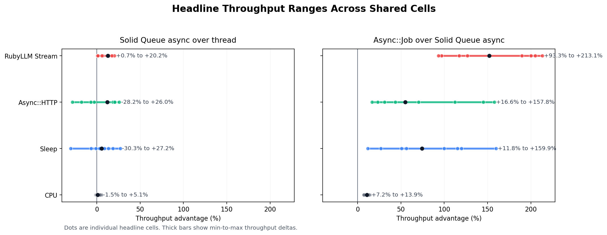
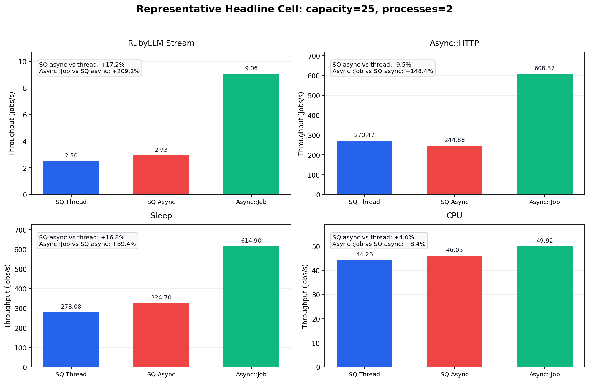

# Solid Queue Bench

Benchmark harness for two related job-system questions:

1. **Within Solid Queue:** how much do I/O-heavy workloads benefit from the new
   `async` worker execution mode compared to `thread` mode?
2. **Across backends:** how does **Solid Queue** compare to **Async::Job +
   Redis** when both are driven through `ActiveJob`?

The benchmark focuses on throughput, memory, CPU, queue delay, service time,
and end-to-end latency.

## Benchmark Families

### 1. Solid Queue

This family compares:

- `thread`
- `async`

against the same Solid Queue backend and the same Rails app.

### 2. Async::Job

This family uses:

- `ActiveJob` adapter: `:async_job`
- queue backend: Redis
- worker execution: async/fiber-based

`Async::Job` does not expose a built-in capacity knob comparable to Solid
Queue, so this harness applies a queue-side concurrency limiter. That makes the
`capacity` matrix dimension mean “maximum concurrent jobs per worker process”
for both families instead of letting Redis-backed workers run unbounded.

## Workloads

### Headline workloads

These are the ones intended for charts and conclusions:

| Workload | Shape | Purpose |
|----------|-------|---------|
| `sleep` | `Kernel.sleep` | Pure cooperative wait upper bound |
| `cpu` | SHA256 loop | CPU-bound control |
| `async_http` | local `Async::HTTP` call | realistic fiber-friendly I/O using the same async client path in both modes |
| `ruby_llm_stream` | fake OpenAI SSE + real RubyLLM chat path + Turbo broadcast jobs | production-shaped streaming chat workload |

### Supplementary workloads

These are useful controls or topology probes, but they are not the main story:

| Workload | Shape | Use |
|----------|-------|-----|
| `http` | local `Net::HTTP` call | blocking HTTP control |
| `llm_batch` | long synthetic external wait | long I/O hold without network noise |
| `llm_stream` | synthetic parent job + child broadcast jobs | queue fan-out topology without RubyLLM/network layers |

## Measurement Notes

The harness now fixes the earlier measurement problems:

- timing starts **after workers are ready**
- benchmark rows are created and enqueued in bulk
- `jobs_per_second` counts **successful jobs only**
- latency percentiles are computed from **successful jobs only**
- repeated cells report a real representative run, not a synthetic hybrid row
- streaming workloads are **child-job aware**, so a run is not complete until
  downstream broadcast jobs finish too

Each result row includes:

- `jobs_per_second`: successful jobs / total wall time
- `finished_jobs_per_second`: all finished attempts / total wall time
- `drain_jobs_per_second`: successful jobs / post-enqueue drain window
- `execution_jobs_per_second`: successful jobs / first successful start to last finish
- RSS and CPU samples across worker processes
- queue delay, service time, and total latency percentiles
- planned vs completed cell counts in the JSON/report output, so failed cells
  are visible in summaries

## Headline Matrix Defaults

The default headline sweep is intentionally narrower than the old one:

- capacities: `5,10,25,50,100`
- Solid Queue processes: `1,2,6`
- Async::Job processes: `1,2,6`
- repeats: `3`
- headline sweeps skip cells where `capacity * processes > 60`, so the main
  suite stays in the comparable region instead of spending time in known
  failure envelopes

Stress capacities `150,200` are available in the full suites.

Environment overrides:

```bash
CAPACITIES=5,10,25,50,100
STRESS_CAPACITIES=150,200
PRESSURE_CAPACITIES=25,50,100,150,200
HEADLINE_MAX_TOTAL_CONCURRENCY=60
SOLID_QUEUE_PROCESSES=1,2,6
ASYNC_JOB_PROCESSES=1,2,6
REPEAT=3
STRESS_SOLID_QUEUE_PROCESSES=2,6
```

## Current Headline Results

These statements reflect the latest headline family sweep from **April 5,
2026**. The generated summaries live in
[`results/README.md`](results/README.md),
[`results/solid-queue/README.md`](results/solid-queue/README.md), and
[`results/async-job/README.md`](results/async-job/README.md).

| Comparison | Current takeaway |
|------------|------------------|
| Solid Queue `async` vs `thread` | The latest headline rerun is modestly positive for `async`, but still not a blanket win. It wins `6/9` shared `sleep` cells, `5/9` `async_http` cells, `7/9` `cpu` cells, and `9/9` `ruby_llm_stream` cells. The strongest headline gains are `+27.2%` on `sleep`, `+26.0%` on `async_http`, `+5.1%` on `cpu`, and `+20.2%` on `ruby_llm_stream`. |
| Async::Job + Redis vs Solid Queue `async` | `Async::Job` remains materially faster across the shared headline cells: `+11.8%` to `+159.9%` on `sleep`, `+16.6%` to `+157.8%` on `async_http`, `+93.3%` to `+213.1%` on `ruby_llm_stream`, and `+7.2%` to `+13.9%` on `cpu`. |

The cleanest production-shaped Solid Queue result is `ruby_llm_stream`: the
real RubyLLM streaming path plus Turbo broadcast jobs benefits from `async`
without changing the app-level topology. `cpu` is the negative control and is
roughly neutral, which makes the I/O and streaming gains more credible.

So the headline story is:

- inside Solid Queue, `async` is a real but moderate win for this workload set
- the streaming-shaped workload is the strongest and cleanest internal result
- Async::Job is still the clear cross-backend throughput leader





The two benchmark families should be read as separate claims:

- **Same backend, different execution mode:** Solid Queue `thread` vs `async`
- **Different backends, same Rails API:** Solid Queue vs Async::Job + Redis

## Stress Suite

The headline suite intentionally stays in a comparable region. To show where
thread mode starts to hurt, there is now a separate Solid Queue stress suite:

```bash
bundle exec rake sweep:solid_queue_stress
```

This suite changes the shape on purpose:

- capacities: `25,50,100,150,200`
- processes: `2,6`
- workloads: `sleep`, `async_http`, `ruby_llm_stream`
- longer waits for `sleep` and `async_http` (`250 ms` by default)
- no `max_total_concurrency` cap

Outputs are written to `results/solid-queue-stress/`. When stress results
exist, `bin/report` also generates:

- `results/solid-queue-stress/stress-cell-status.png`
- `results/solid-queue-stress/stress-throughput-envelope.png`
- `results/solid-queue-stress/stress-rss-envelope.png`

This suite is for failure envelope, queueing pressure, and resource blow-up,
not for the main apples-to-apples headline comparison.

In the current stress run, thread mode completed only the baseline
`cap=25, proc=2` cell for each workload, while `async` completed all `10/10`
stress cells per workload. That is the clearest evidence that "threads start
to hurt" is mostly a failure-envelope story rather than a small per-cell
throughput story.

## Setup

Requirements:

- Ruby 4.0+
- PostgreSQL
- Docker-backed Redis for the Async::Job family, or a local Redis on `127.0.0.1:6379`

When `REDIS_HOST` is local and Docker is available, the Async::Job benchmark
path will start a local `redis:7-alpine` container automatically if Redis is
not already reachable.

Database credentials:

```bash
export DB_USER=your_user
export DB_PASSWORD=your_password
# optional: DB_HOST, DB_PORT
```

Redis defaults:

```bash
export REDIS_HOST=127.0.0.1
export REDIS_PORT=6379
export REDIS_DB=15
export REDIS_PREFIX=solid_queue_bench:development
export ASYNC_JOB_DB_POOL=10  # optional override for Async::Job AR pool sizing
```

Then:

```bash
bin/setup
```

`bin/setup` now:

- installs gems
- prepares the database
- ensures Solid Queue schema exists
- loads the RubyLLM model catalog used by `ruby_llm_stream`

The Gemfile expects a local Solid Queue checkout:

```ruby
gem "solid_queue", path: "../solid_queue"
```

## Running

### Single benchmark

Solid Queue:

```bash
bin/benchmark --backend solid_queue --modes thread,async \
  --workload async_http --duration-ms 50 --jobs 1000 --capacity 50 --processes 1
```

Async::Job:

```bash
bin/benchmark --backend async_job --modes async \
  --workload async_http --duration-ms 50 --jobs 1000 --capacity 50 --processes 1
```

RubyLLM streaming:

```bash
bin/benchmark --backend solid_queue --modes thread,async \
  --workload ruby_llm_stream --jobs 20 --capacity 25 --processes 1 \
  --token-count 40 --token-delay-ms 20 --llm-model gpt-4.1-mini
```

### Matrix

Solid Queue:

```bash
bin/matrix --backend solid_queue --workload async_http --jobs 1000 \
  --capacities 5,10,25,50,100 --processes 1,2,6 --modes thread,async \
  --repeat 3 --max-total-concurrency 60
```

Async::Job:

```bash
bin/matrix --backend async_job --workload async_http --jobs 1000 \
  --capacities 5,10,25,50,100 --processes 1,2,6 --modes async \
  --repeat 3 --max-total-concurrency 60
```

### Sweep tasks

Headline Solid Queue suite:

```bash
bundle exec rake sweep:solid_queue_headline
```

Solid Queue stress suite:

```bash
bundle exec rake sweep:solid_queue_stress
```

Headline Async::Job suite:

```bash
bundle exec rake sweep:async_job_headline
```

Both headline families:

```bash
bundle exec rake sweep:families
```

Full suites including supplementary workloads and stress capacities:

```bash
bundle exec rake sweep:solid_queue_full
bundle exec rake sweep:async_job_full
bundle exec rake sweep:full
```

Single-workload sweeps:

```bash
bundle exec rake sweep:sleep
bundle exec rake sweep:ruby_llm_stream
bundle exec rake sweep:async_job_sleep
bundle exec rake sweep:async_job_ruby_llm_stream
```

### Charts

Charts are generated automatically when Python 3 with matplotlib is available.
Benchmark summary indexes are generated automatically by the sweep tasks and can
also be refreshed manually with:

```bash
bin/report
```

This regenerates:

- `results/README.md`
- `results/solid-queue/README.md`
- `results/async-job/README.md`
- `results/headline-throughput-ranges.png`
- `results/headline-representative-cell.png`
- `results/solid-queue-stress/stress-cell-status.png` when stress results exist
- `results/solid-queue-stress/stress-throughput-envelope.png` when stress results exist
- `results/solid-queue-stress/stress-rss-envelope.png` when stress results exist

Manual plotting:

```bash
bin/plot results/solid-queue/sleep-data.csv
bin/plot results/async-job/sleep-data.csv
```

## Output Layout

Per-family results are written to:

- `results/solid-queue/`
- `results/async-job/`
- `results/solid-queue-stress/` for the failure-envelope stress suite

Matrix JSON/CSV artifacts are written to:

- `tmp/benchmarks/solid-queue/`
- `tmp/benchmarks/async-job/`
- `tmp/benchmarks/solid-queue-stress/`

## RubyLLM Streaming Benchmark

`ruby_llm_stream` is the main production-shaped streaming benchmark.

It uses:

- the generated RubyLLM chat stack
- a local fake OpenAI-compatible `/v1/chat/completions` SSE server
- the real `chat.ask` streaming path
- per-token Turbo broadcast jobs

That keeps the benchmark local and repeatable while still exercising the Rails
job topology you would actually use in a streaming chat UI.

`async_http` is also normalized now: thread-mode workers wrap the
`Async::HTTP` client call in `Sync`, so the benchmark compares worker
execution models instead of “has a reactor” vs “does not have a reactor”.

## Caveats

- Checked-in `results/` files may be smoke outputs or historical artifacts. If
  you want publishable numbers, rerun the suites on a quiet machine.
- `llm_batch` and `llm_stream` are synthetic. They are useful, but they are not
  a substitute for `ruby_llm_stream`.
- The benchmark uses aggressive queue polling for the Solid Queue family, so it
  is best understood as a comparison of execution/back-end behavior under a
  low-latency benchmark configuration, not a benchmark of untouched default
  production settings.
