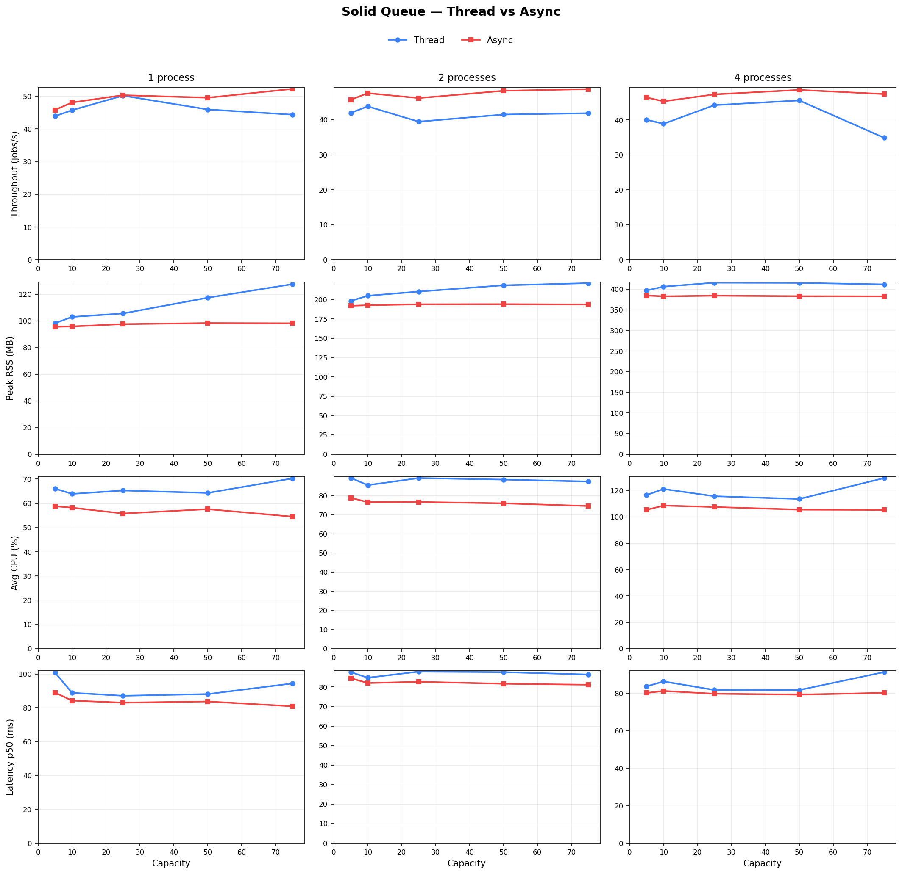
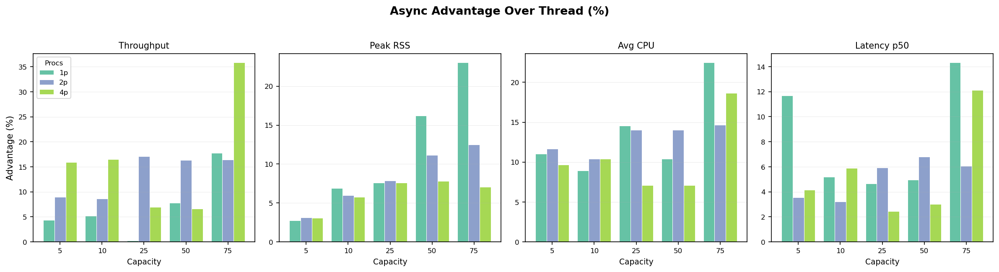
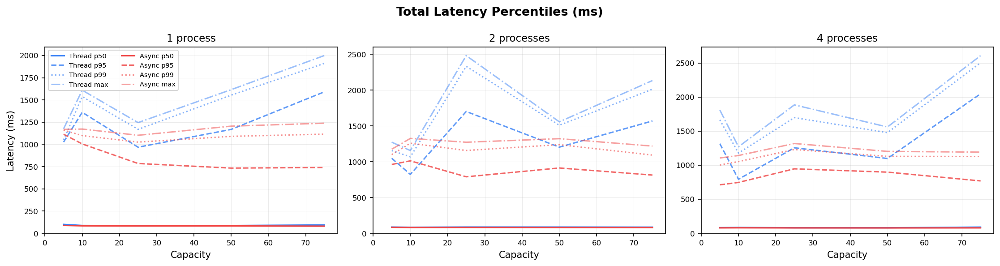
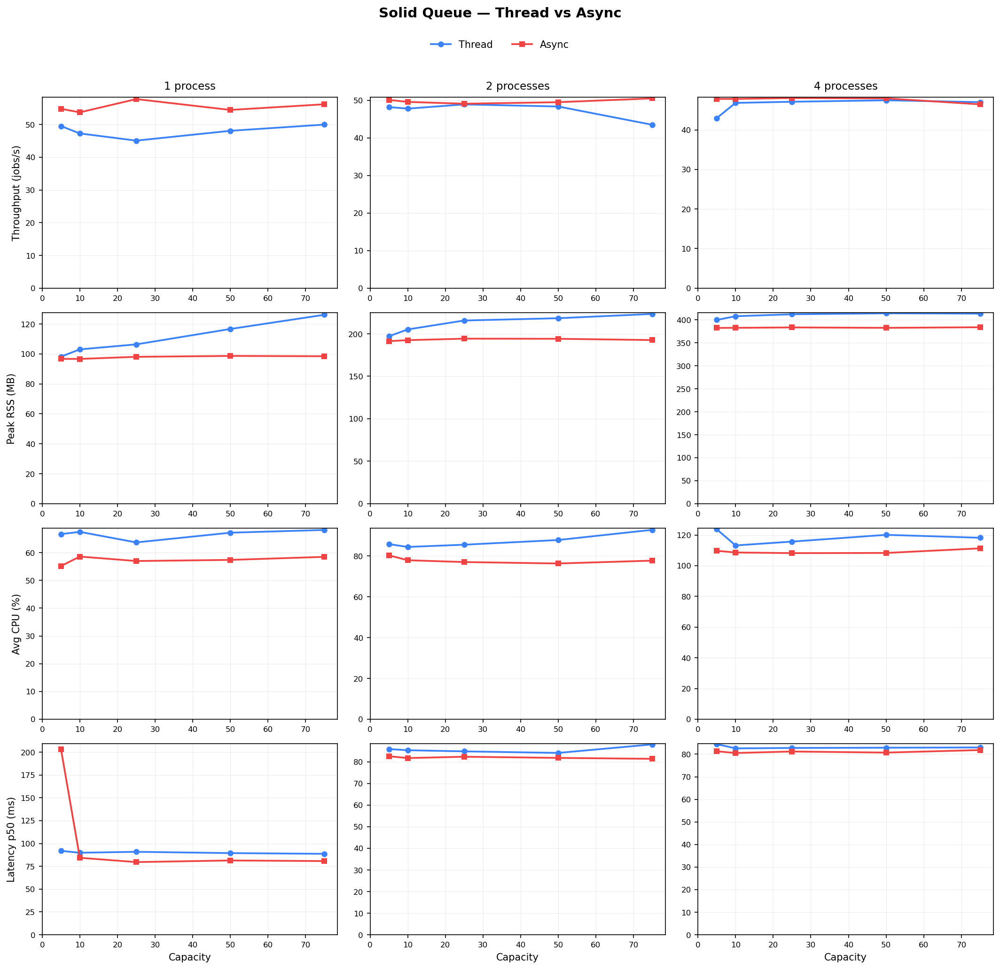
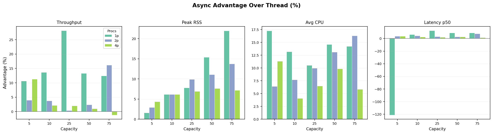
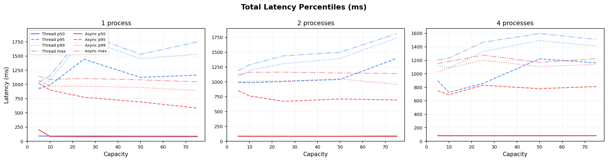

# Solid Queue Bench

Benchmark harness comparing Solid Queue's **thread** and **async** (fiber-based)
worker execution modes. Sweeps across capacity and process counts to show how
each mode scales under different configurations.

This app lives outside the Solid Queue repo so you can benchmark the current
branch without polluting the gem itself.

## Key Findings

### Async wins on every axis

| Metric | Sleep Workload | HTTP Workload |
|--------|---------------|---------------|
| Throughput | +4% to +36% faster | up to +28% faster |
| Peak RSS | 3--23% less memory | 2--22% less memory |
| Avg CPU | 7--23% lower usage | 4--17% lower usage |
| Latency p50 | 3--14% lower | 2--12% lower |

### Memory stays flat with async

Thread mode RSS grows linearly with capacity --- each OS thread allocates its own
stack. Async mode RSS barely changes because all fibers share a single reactor
thread.

At capacity 75 with 1 process:

- **Thread**: 131 MB peak RSS
- **Async**: 98 MB peak RSS (25% less)

At capacity 75 with 4 processes:

- **Thread**: 412 MB peak RSS
- **Async**: 383 MB peak RSS (7% less)

The per-process savings are diluted at higher process counts because the base
process memory (~95 MB) dominates.

### DB connections are the practical ceiling

Thread mode requires `capacity + 5` database connections per worker. At
capacity 100, this exceeds PostgreSQL's default `max_connections = 100` and
the worker crashes on startup.

Async mode requires only `max(5, processes + 4)` connections **regardless of
capacity**. It can run at capacity 1000+ with just 5 connections per worker.

## Results

All results captured on Ruby 3.3.5, PostgreSQL `max_connections = 100`,
`isolation_level: :fiber`, Linux 6.x x86_64.

### Sleep Workload

50 ms sleep per job, 500 jobs per cell, capacities 5--75, 1/2/4 processes.



The grid shows four metrics (throughput, peak RSS, avg CPU, latency p50)
across three process counts. Async (red) consistently outperforms thread
(blue): higher throughput, lower memory, lower CPU, lower latency. The
advantage widens as capacity grows.



All bars are positive --- async wins at every (capacity, processes) point in
the matrix. Memory savings (Peak RSS) grow steadily with capacity because
thread overhead is per-slot while fiber overhead is essentially zero.

<details>
<summary>Per-cell advantage table (positive = async wins)</summary>

| Capacity | Processes | Throughput | Peak RSS | Avg CPU | Latency p50 |
|----------|-----------|-----------|----------|---------|-------------|
| 5 | 1 | +4.4% | +2.7% | +11.0% | +11.7% |
| 10 | 1 | +5.2% | +6.9% | +8.9% | +5.2% |
| 25 | 1 | +0.3% | +7.6% | +14.5% | +4.7% |
| 50 | 1 | +7.8% | +16.2% | +10.4% | +5.0% |
| 75 | 1 | +17.8% | +23.0% | +22.5% | +14.3% |
| 5 | 2 | +9.0% | +3.1% | +11.7% | +3.5% |
| 10 | 2 | +8.6% | +6.0% | +10.4% | +3.2% |
| 25 | 2 | +17.1% | +7.8% | +14.0% | +5.9% |
| 50 | 2 | +16.4% | +11.2% | +14.0% | +6.8% |
| 75 | 2 | +16.4% | +12.5% | +14.7% | +6.1% |
| 5 | 4 | +15.9% | +3.1% | +9.7% | +4.2% |
| 10 | 4 | +16.5% | +5.8% | +10.4% | +5.9% |
| 25 | 4 | +7.0% | +7.6% | +7.1% | +2.5% |
| 50 | 4 | +6.6% | +7.8% | +7.1% | +3.0% |
| 75 | 4 | +35.8% | +7.0% | +18.7% | +12.1% |

</details>



Thread tail latencies (p95/p99/max, dashed blue) grow faster than async
(dashed red) as capacity increases, indicating that thread scheduling
contention creates more unpredictable delays under load.

### HTTP Workload

50 ms local delay server, 500 jobs per cell, same parameter grid. This
exercises real `Net::HTTP` I/O rather than cooperative `sleep`.



The same directional trends hold with real network I/O but with more variance
from actual TCP/HTTP overhead.



<details>
<summary>Per-cell advantage table (positive = async wins)</summary>

| Capacity | Processes | Throughput | Peak RSS | Avg CPU | Latency p50 |
|----------|-----------|-----------|----------|---------|-------------|
| 5 | 1 | +10.6% | +1.6% | +17.2% | outlier |
| 10 | 1 | +13.6% | +6.2% | +13.2% | +6.2% |
| 25 | 1 | +28.1% | +7.8% | +10.5% | +12.4% |
| 50 | 1 | +13.3% | +15.4% | +14.6% | +9.0% |
| 75 | 1 | +12.4% | +21.9% | +14.2% | +9.0% |
| 5 | 2 | +4.0% | +2.9% | +6.4% | +3.9% |
| 10 | 2 | +3.7% | +6.2% | +7.7% | +4.3% |
| 25 | 2 | +0.4% | +9.9% | +9.9% | +2.9% |
| 50 | 2 | +2.4% | +11.1% | +13.1% | +2.7% |
| 75 | 2 | +16.2% | +13.8% | +16.3% | +7.6% |
| 5 | 4 | +11.3% | +4.3% | +11.3% | +3.8% |
| 10 | 4 | +2.2% | +6.2% | +4.1% | +2.5% |
| 25 | 4 | +2.0% | +6.9% | +6.5% | +1.9% |
| 50 | 4 | +1.0% | +7.6% | +9.8% | +2.6% |
| 75 | 4 | -1.2% | +7.2% | +5.8% | +1.4% |

</details>



## What It Measures

For each (mode, capacity, processes) cell, the runner records:

- **Throughput** --- wall-clock time and jobs/sec
- **Queue delay** percentiles (enqueue to job start)
- **Service time** percentiles (job start to job finish)
- **Total latency** percentiles (enqueue to job finish)
- **Peak and average RSS** --- sampled from `/proc/[pid]/status` every 100 ms
- **Average and peak CPU %** --- computed from `/proc/[pid]/stat` utime + stime

## Workloads

| Workload | What it does | Best for testing |
|----------|-------------|-----------------|
| `sleep` | `Kernel.sleep(duration)` | Cooperative I/O scheduling |
| `http` | `Net::HTTP.get` to a local delay server | Real network I/O |
| `cpu` | SHA256 hashing loop | CPU-bound baseline (control) |

The `sleep` and `http` workloads are most relevant for async/fiber concurrency.
The `cpu` workload is useful as a control since async should not help
CPU-bound jobs.

## Requirements

- Ruby 3.3+
- PostgreSQL
- `config.active_support.isolation_level = :fiber` (set in `config/application.rb`)

## Setup

```bash
cd solid_queue_bench

# Database credentials
export DB_USER=your_user
export DB_PASSWORD=your_password
# optional: DB_HOST, DB_PORT

bin/setup
```

The Gemfile references a local checkout of Solid Queue:

```ruby
gem "solid_queue", path: "../solid_queue"
```

Adjust this to point to your own checkout or a git ref.

## Running

### Single comparison

```bash
bin/benchmark --workload sleep --duration-ms 50 --jobs 500 --capacity 50
```

Runs both thread and async modes at the given capacity, writes JSON to
`tmp/benchmarks/`.

### Matrix sweep

```bash
# Full default sweep (2 modes x 5 capacities x 3 process counts = 30 cells)
bin/matrix --workload sleep --duration-ms 50 --jobs 500

# Custom grid
bin/matrix --capacities 10,50,100 --processes 1,2 --jobs 200

# CPU workload
bin/matrix --workload cpu --iterations 25000 --capacities 5,10,25

# Named run
bin/matrix --name v2-sleep --workload sleep
```

Writes JSON, CSV, and PNG/SVG charts to `tmp/benchmarks/`. Charts are
generated automatically if Python 3 with matplotlib is available.

### Generate charts from existing data

```bash
bin/plot results/sleep-data.csv
bin/plot tmp/benchmarks/some-sweep.csv --output-dir tmp/charts
```

### Options

```
bin/matrix --help
bin/benchmark --help
bin/plot --help
```

## Notes

- Thread mode's DB pool requirement (`capacity + 5`) limits practical scaling.
  High-capacity thread workers may need `max_connections` tuned in PostgreSQL.
- Async mode requires the `async` gem and fiber-scoped isolation level.
  Without `isolation_level: :fiber`, multiple fibers sharing thread-scoped
  Active Record state can corrupt connection/query state.
- Adding worker processes multiplies memory but does not proportionally
  increase throughput for I/O-bound work --- the bottleneck is I/O wait, not CPU.
- This benchmark isolates worker execution behavior. It does not model a full
  production application with mixed workloads or external dependencies.
