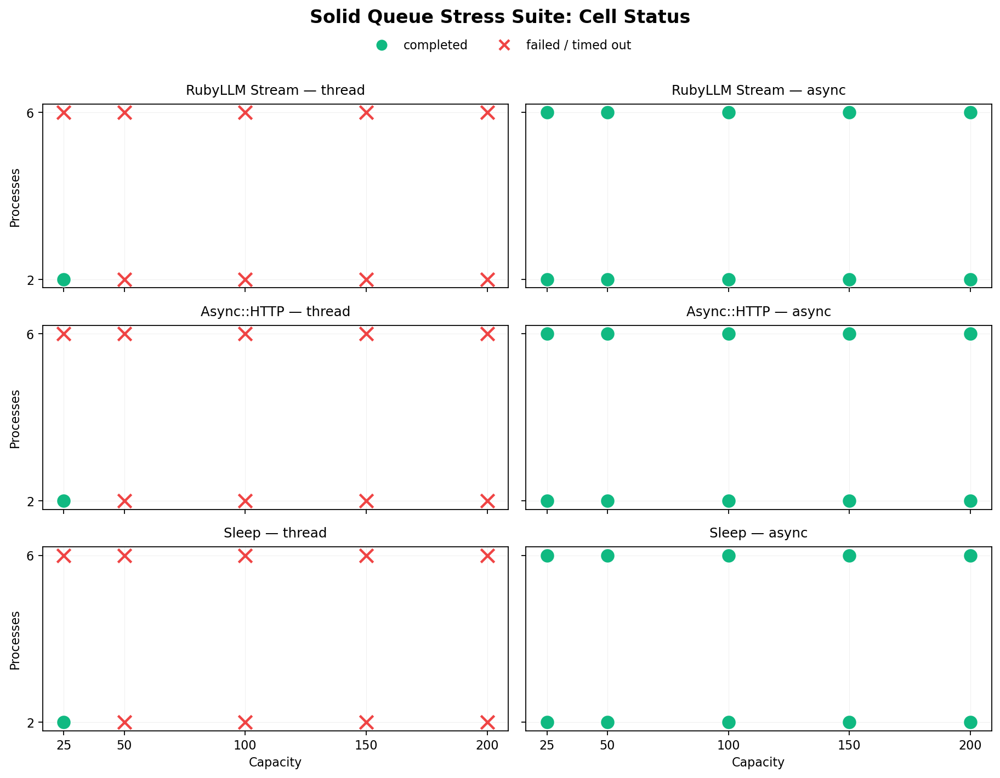
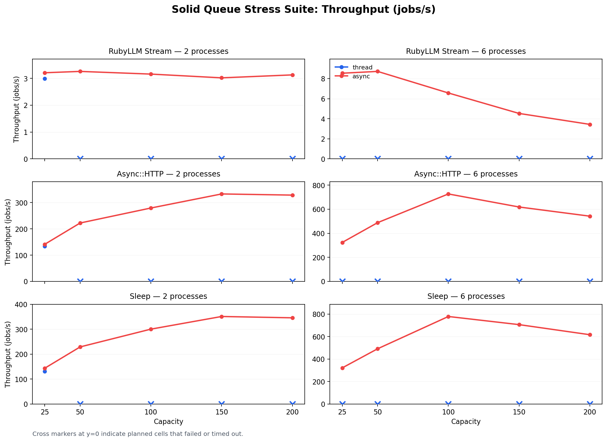
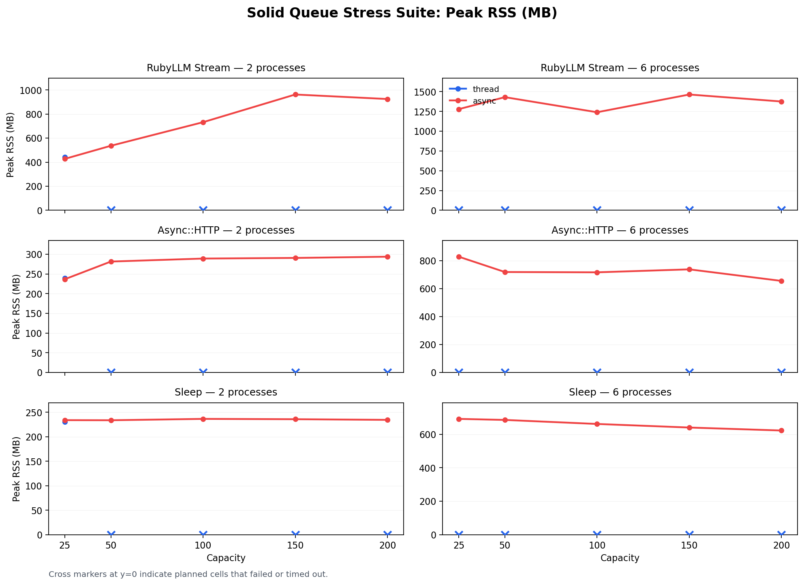

# Solid Queue Bench

Benchmark harness for three questions:

1. **Within Solid Queue:** how much do I/O-heavy workloads benefit from `async`
   execution compared to `thread` mode?
2. **DB pool ceiling:** at what concurrency does `thread` mode exhaust the
   database connection pool, and how much further does `async` go?
3. **Across backends:** how does Solid Queue compare to Async::Job + Redis when
   both run through ActiveJob?

Measures throughput, memory, CPU, queue delay, service time, and end-to-end
latency.

## Benchmark Families

### Solid Queue

Compares `thread` and `async` execution against the same backend and Rails app.

### Async::Job

Uses the `:async_job` ActiveJob adapter with a Redis backend and fiber-based
execution. A queue-side concurrency limiter makes the `capacity` dimension mean
"maximum concurrent jobs per worker process" for both families.

## Workloads

### Headline

These drive the charts and conclusions:

| Workload | Shape | Purpose |
|----------|-------|---------|
| `sleep` | `Kernel.sleep` | Cooperative wait upper bound |
| `cpu` | SHA256 loop | CPU-bound control |
| `async_http` | Local `Async::HTTP` call | Fiber-friendly I/O |
| `ruby_llm_stream` | Fake OpenAI SSE + RubyLLM chat + Turbo broadcasts | Production-shaped streaming |

### Supplementary

Useful controls, not the main story:

| Workload | Shape |
|----------|-------|
| `http` | Local `Net::HTTP` call (blocking HTTP control) |
| `llm_batch` | Long synthetic external wait |
| `llm_stream` | Synthetic parent job + child broadcast jobs |

## Current Results

Latest headline sweep: **April 5, 2026**.
Solid Queue commit under test: [305bf4018352e099019f9f24502a18ee4794e64e](https://github.com/crmne/solid_queue/commit/305bf4018352e099019f9f24502a18ee4794e64e)
(`305bf40`, `Relax async lifecycle start wait`).

Full generated summaries:
[results/](results/README.md) |
[solid-queue/](results/solid-queue/README.md) |
[async-job/](results/async-job/README.md) |
[stress/](results/solid-queue-stress/README.md)

### Solid Queue: async vs thread

`async` wins the majority of headline tests. Strongest gains:

| Workload | Best delta | Win rate |
|----------|-----------|----------|
| `sleep` | +27.2% | 6/9 |
| `async_http` | +26.0% | 5/9 |
| `cpu` | +5.1% | 7/9 |
| `ruby_llm_stream` | +20.2% | 9/9 |

`ruby_llm_stream` is the cleanest result: real RubyLLM streaming plus Turbo
broadcasts, benefiting from `async` without any topology changes. `cpu` staying
roughly neutral is the expected control, which makes the I/O gains credible.

The win is not raw throughput -- it is good I/O performance without thread-sized
DB pools and the connection pressure that comes with them.

### Async::Job vs Solid Queue

Async::Job + Redis is faster across all shared headline tests:

| Workload | Range |
|----------|-------|
| `sleep` | +11.8% to +159.9% |
| `async_http` | +16.6% to +157.8% |
| `ruby_llm_stream` | +93.3% to +213.1% |
| `cpu` | +7.2% to +13.9% |

Different question, different backend. Read this as a throughput ceiling
reference, not a same-backend comparison.

### Bottom line

- Inside Solid Queue, `async` is a real win for I/O-heavy work
- Streaming workloads see the strongest gains
- Under stress, `thread` hits the DB pool wall early; `async` keeps going
- For maximum throughput, Async::Job is faster
- For staying on Solid Queue, `async` trades some throughput ceiling for smaller
  DB pools and the Rails-native / Mission Control story


## Stress Suite (DB Pool Ceiling)

The headline suite caps total concurrency to keep the comparison fair. The stress
suite removes that cap to answer the second question: where does `thread` mode
hit the DB connection pool wall, and how much further can `async` push?

```bash
bundle exec rake sweep:solid_queue_stress
```

Configuration:

- Capacities: `25,50,100,150,200`
- Processes: `2,6`
- Workloads: `sleep`, `async_http`, `ruby_llm_stream`
- Longer waits for `sleep` and `async_http` (`250 ms` default)
- `ruby_llm_stream` keeps the same token count and token delay as the headline suite

In the current run, `thread` mode hit the DB pool ceiling after the baseline
`cap=25, proc=2` test and failed every higher-concurrency cell. `async`
completed all 10/10 planned tests per workload. Thread mode needs one DB
connection per concurrent job; `async` multiplexes fibers over a much smaller
pool, so it survives where threads cannot.







## Measurement

- Timing starts after workers are ready
- Rows are created and enqueued in bulk
- `jobs_per_second` counts successful jobs only
- Latency percentiles are from successful jobs only
- Repeated tests report a real representative run, not a synthetic hybrid
- Streaming workloads are child-job aware (run is not complete until downstream
  broadcast jobs finish)

Each result row includes throughput metrics (`jobs_per_second`,
`drain_jobs_per_second`, `execution_jobs_per_second`), RSS and CPU samples
across worker processes, and queue delay / service time / total latency
percentiles. Planned vs completed test counts are in the JSON output so failed
tests stay visible.

## Setup

Requirements: Ruby 4.0+, PostgreSQL, Redis (Docker or local on `127.0.0.1:6379`).

The Async::Job path auto-starts a `redis:7-alpine` container when Docker is
available and Redis is not reachable.

The Gemfile expects a local Solid Queue checkout:

```ruby
gem "solid_queue", path: "../solid_queue"
```

```bash
export DB_USER=your_user
export DB_PASSWORD=your_password

bin/setup
```

`bin/setup` installs gems, prepares the database, ensures the Solid Queue
schema exists, and loads the RubyLLM model catalog.

## Running

### Single benchmark

```bash
# Solid Queue
bin/benchmark --backend solid_queue --modes thread,async \
  --workload async_http --duration-ms 50 --jobs 1000 --capacity 50 --processes 1

# Async::Job
bin/benchmark --backend async_job --modes async \
  --workload async_http --duration-ms 50 --jobs 1000 --capacity 50 --processes 1

# RubyLLM streaming
bin/benchmark --backend solid_queue --modes thread,async \
  --workload ruby_llm_stream --jobs 20 --capacity 25 --processes 1 \
  --token-count 40 --token-delay-ms 20 --llm-model gpt-4.1-mini
```

### Matrix

```bash
bin/matrix --backend solid_queue --workload async_http --jobs 1000 \
  --capacities 5,10,25,50,100 --processes 1,2,6 --modes thread,async \
  --repeat 3 --max-total-concurrency 60
```

### Sweep tasks

```bash
bundle exec rake sweep:solid_queue_headline   # Headline Solid Queue
bundle exec rake sweep:solid_queue_stress      # Stress suite
bundle exec rake sweep:async_job_headline      # Headline Async::Job
bundle exec rake sweep:families                # Both headline families
bundle exec rake sweep:full                    # Everything
```

Single-workload sweeps are also available (`sweep:sleep`,
`sweep:ruby_llm_stream`, `sweep:async_job_sleep`, etc.).

### Charts and reports

Charts generate automatically when Python 3 with matplotlib is available.
Refresh all generated summaries and plots:

```bash
bin/report
```

Plot a single dataset:

```bash
bin/plot results/solid-queue/sleep-data.csv
```

## Matrix Defaults

| Parameter | Headline | Stress |
|-----------|----------|--------|
| Capacities | `5,10,25,50,100` | `25,50,100,150,200` |
| Processes | `1,2,6` | `2,6` |
| Repeats | `3` | `3` |
| Max total concurrency | `60` | none |

Override with environment variables:

```bash
CAPACITIES=5,10,25,50,100
PRESSURE_CAPACITIES=25,50,100,150,200
STRESS_CAPACITIES=150,200   # appended only by sweep:full
HEADLINE_MAX_TOTAL_CONCURRENCY=60
SOLID_QUEUE_PROCESSES=1,2,6
ASYNC_JOB_PROCESSES=1,2,6
REPEAT=3
```

## Output Layout

```
results/solid-queue/          # Headline Solid Queue
results/async-job/            # Headline Async::Job
results/solid-queue-stress/   # Stress suite
tmp/benchmarks/               # Raw matrix JSON/CSV
```

## Caveats

- Checked-in results may be smoke outputs or historical artifacts. Rerun on a
  quiet machine for publishable numbers.
- `llm_batch` and `llm_stream` are synthetic controls, not substitutes for
  `ruby_llm_stream`.
- The harness uses aggressive queue polling, so these numbers reflect execution
  behavior under a low-latency benchmark configuration, not default production
  settings.
