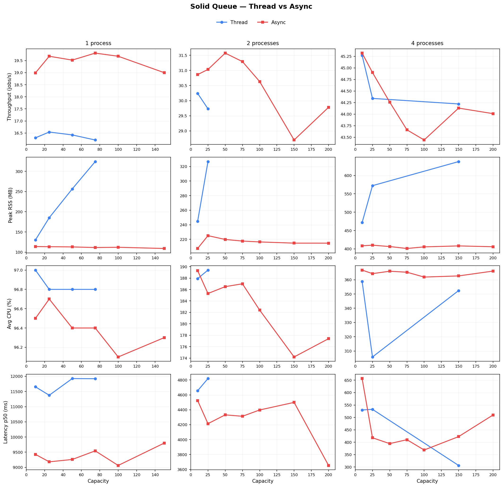
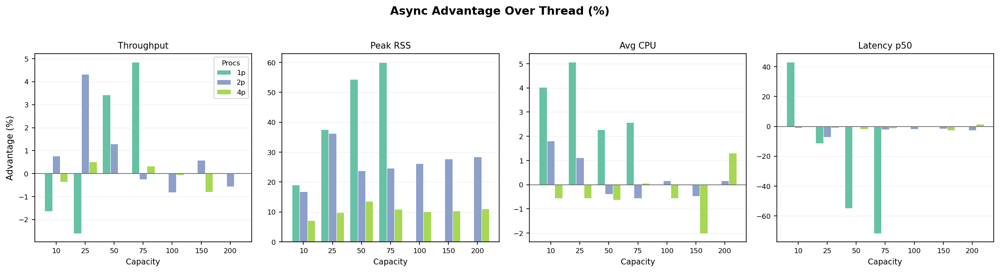

# Solid Queue Bench

Benchmark harness comparing Solid Queue's **thread** and **async** (fiber-based)
worker execution modes across a matrix of concurrency configurations. The goal
is to quantify throughput, memory, CPU, and latency differences as capacity and
process counts scale.

## Experiment Design

### What we are comparing

Solid Queue can execute claimed jobs in two modes:

- **Thread mode** (`execution_mode: thread`) -- each job runs in an OS thread
  from a `Concurrent::ThreadPoolExecutor`. The pool pre-allocates threads up to
  the configured capacity. Each thread holds its own Active Record database
  connection for the duration of the job.

- **Async mode** (`execution_mode: async`) -- each job runs as a Ruby Fiber on
  a single reactor thread (via the [`async`](https://github.com/socketry/async)
  gem). Fibers yield cooperatively during I/O, so hundreds of fibers can share a
  small number of database connections.

### Independent variables

| Variable | Values | What it controls |
|----------|--------|-----------------|
| **Execution mode** | `thread`, `async` | How jobs are scheduled within a worker |
| **Capacity** | 10, 25, 50, 75, 100, 150, 200 | Max concurrent jobs per worker process (threads or fibers) |
| **Worker processes** | 1, 2, 4 | Number of forked worker processes |

Each unique (mode, capacity, processes) combination is one **cell** in the
matrix. Each cell was run 3 times and we report the **median** result.

### Dependent variables (what we measure)

| Metric | How it is collected |
|--------|-------------------|
| **Throughput** (jobs/sec) | Total completed jobs / wall-clock time |
| **Peak RSS** (MB) | Max resident set size across all worker PIDs, sampled from `/proc/[pid]/status` every 100 ms |
| **Avg RSS** (MB) | Mean of all RSS samples during the run |
| **Avg CPU** (%) | Total CPU time (user + system from `/proc/[pid]/stat`) / wall time. Values above 100% indicate multi-core usage |
| **Peak CPU** (%) | Max instantaneous CPU % between consecutive samples |
| **Queue delay** (ms) | Time from enqueue to job start, reported as p50/p95/p99/max |
| **Service time** (ms) | Time the job actually runs, reported as p50/p95/p99/max |
| **Total latency** (ms) | Time from enqueue to job finish (queue delay + service time) |

### Workloads

| Workload | What each job does | Jobs per cell | Purpose |
|----------|-------------------|---------------|---------|
| **sleep** | `Kernel.sleep(0.05)` (50 ms) | 2,000 | Pure cooperative I/O wait -- best-case scenario for async |
| **cpu** | 50,000 SHA256 hash iterations (~50 ms) | 500 | CPU-bound control -- tests behavior under the GVL |
| **http** | `Net::HTTP.get` to a local delay server (50 ms) | 2,000 | Real TCP/HTTP I/O through Ruby's network stack |
| **async_http** | `Async::HTTP` to a local delay server (50 ms) | 2,000 | Fiber-native HTTP I/O |

### Database connection requirements

This is the critical scaling difference between the two modes:

| Mode | DB pool per worker | At capacity 100, 1 process | At capacity 200, 4 processes |
|------|-------------------|---------------------------|------------------------------|
| Thread | `capacity + 5` | 105 connections | 4 x 205 = 820 connections |
| Async | `max(5, processes + 4)` | 5 connections | 8 connections |

PostgreSQL's default `max_connections` is 100. Thread mode at capacity 100+
requires more connections than the server allows and fails to start.

### Environment

- Ruby 4.0.2, PostgreSQL `max_connections = 100`
- `config.active_support.isolation_level = :fiber`
- Linux 6.x, x86_64
- Solid Queue from local `async-worker-execution-mode` branch

## Results

### Sleep Workload

50 ms sleep, 2,000 jobs per cell, 3 repetitions (median reported). All 42 cells
completed with 0 failures. This is the primary benchmark.


Each column is a process count (1, 2, 4). Each row is a metric. Blue = thread,
red = async. At 1 and 2 processes, async matches or exceeds thread throughput
while consuming 10-28% less memory. At 4 processes, throughput converges (both
modes saturate the scheduler) but async still uses consistently less RSS. Thread
mode's memory footprint grows with capacity due to per-thread stack allocations;
async stays nearly flat because fibers share a single stack.


Bars show the percentage improvement of async over thread for each
(capacity, processes) pair. Negative values on RSS and CPU mean async uses
fewer resources. Throughput advantage is strongest at low process counts
(up to +12% at 1 process). All 42 cells completed -- no thread failures in this
workload.


Latency distributions (p50/p95/p99/max) for queue delay, service time, and total
latency. Async shows tighter p50 total latency at 1 and 2 processes. Tail
latencies (p95/p99) are comparable, with async generally lower at 1 process.

<details>
<summary>Per-cell advantage data (sleep)</summary>

Advantage = (async - thread) / thread * 100. Negative RSS/CPU/latency values mean async uses fewer resources.

| Cap | Procs | Thread j/s | Async j/s | Tput % | Thread RSS MB | Async RSS MB | RSS % | Thread CPU % | Async CPU % | CPU % | Thread p50 ms | Async p50 ms | Lat p50 % |
|-----|-------|-----------|----------|--------|--------------|-------------|-------|-------------|------------|-------|--------------|-------------|-----------|
| 10 | 1 | 46.0 | 49.8 | +8.3 | 119 | 107 | -10.5 | 65.9 | 57.0 | -13.5 | 86 | 81 | -5.8 |
| 25 | 1 | 44.9 | 49.6 | +10.3 | 115 | 112 | -2.4 | 67.6 | 56.4 | -16.6 | 87 | 81 | -6.6 |
| 50 | 1 | 47.4 | 51.1 | +7.7 | 153 | 115 | -25.0 | 65.1 | 53.3 | -18.1 | 85 | 80 | -5.9 |
| 75 | 1 | 44.2 | 49.6 | +12.4 | 148 | 107 | -27.7 | 66.5 | 56.9 | -14.4 | 87 | 81 | -6.4 |
| 100 | 1 | 48.0 | 43.1 | -10.3 | 142 | 106 | -25.5 | 66.5 | 56.6 | -14.9 | 85 | 85 | -0.7 |
| 150 | 1 | 47.8 | 48.8 | +2.0 | 142 | 107 | -24.8 | 66.6 | 56.7 | -14.9 | 85 | 81 | -4.3 |
| 200 | 1 | 47.4 | 51.9 | +9.5 | 148 | 111 | -25.1 | 67.3 | 54.1 | -19.6 | 85 | 80 | -6.1 |
| 10 | 2 | 46.7 | 47.2 | +1.1 | 240 | 213 | -11.5 | 81.4 | 73.6 | -9.6 | 82 | 80 | -2.1 |
| 25 | 2 | 44.6 | 48.1 | +7.8 | 227 | 216 | -4.9 | 85.6 | 74.6 | -12.9 | 83 | 80 | -3.2 |
| 50 | 2 | 45.2 | 47.5 | +5.1 | 272 | 212 | -21.9 | 83.8 | 73.7 | -12.1 | 82 | 80 | -2.4 |
| 75 | 2 | 46.5 | 44.3 | -4.6 | 262 | 209 | -20.1 | 81.8 | 77.4 | -5.4 | 82 | 81 | -1.0 |
| 100 | 2 | 44.9 | 44.4 | -1.1 | 263 | 212 | -19.5 | 82.4 | 78.8 | -4.4 | 83 | 81 | -1.7 |
| 150 | 2 | 45.1 | 47.9 | +6.3 | 268 | 226 | -15.6 | 82.3 | 73.5 | -10.7 | 82 | 80 | -3.0 |
| 200 | 2 | 46.5 | 48.8 | +5.0 | 261 | 226 | -13.7 | 82.7 | 73.7 | -10.9 | 82 | 80 | -2.8 |
| 10 | 4 | 47.3 | 46.4 | -2.1 | 477 | 420 | -11.8 | 104.2 | 104.1 | -0.1 | 79 | 80 | +0.5 |
| 25 | 4 | 47.9 | 43.2 | -9.8 | 459 | 419 | -8.7 | 104.1 | 108.1 | +3.8 | 79 | 80 | +0.4 |
| 50 | 4 | 47.4 | 39.3 | -17.0 | 478 | 414 | -13.5 | 102.7 | 112.8 | +9.8 | 79 | 81 | +2.8 |
| 75 | 4 | 47.4 | 47.4 | +0.0 | 486 | 416 | -14.5 | 103.0 | 103.5 | +0.5 | 79 | 79 | -0.1 |
| 100 | 4 | 47.6 | 47.0 | -1.2 | 463 | 415 | -10.3 | 103.3 | 103.0 | -0.3 | 79 | 79 | +0.2 |
| 150 | 4 | 47.2 | 47.9 | +1.5 | 478 | 416 | -13.0 | 102.8 | 102.7 | -0.1 | 79 | 79 | -0.5 |
| 200 | 4 | 42.2 | 47.2 | +11.7 | 482 | 417 | -13.5 | 111.5 | 102.3 | -8.3 | 81 | 79 | -2.2 |

</details>

### CPU Workload (Control)

50,000 SHA256 iterations per job (~50 ms of pure CPU), 500 jobs per cell.
This is the **control** workload -- async fibers cannot parallelize CPU-bound
work any better than threads because both are limited by Ruby's GVL to one core
per process.

Thread mode data is incomplete: many high-capacity thread cells failed due to
database connection exhaustion or excessive scheduling overhead. Thread data
exists only for capacity 10-75 at 1 process, capacity 10-25 at 2 processes, and
capacity 10/25/150 at 4 processes. All 21 async cells completed.



Where both modes ran, throughput is GVL-limited and roughly equal: ~16-19 j/s at
1 process, ~29-31 j/s at 2 processes, ~44-45 j/s at 4 processes. However, async
is actually slightly **faster** at 1 process (~19 j/s vs ~16 j/s) because fiber
scheduling has less overhead than thread scheduling under the GVL.

Two things stand out:

1. **Thread mode fails at high capacity.** Thread scheduling overhead with 100+
   threads doing CPU-bound work under the GVL causes timeouts and connection
   exhaustion. Async runs all capacities without issue.

2. **RSS diverges massively.** Where both modes ran, thread RSS grows linearly
   with capacity while async stays flat. At 1 process with capacity 75, thread
   uses 324 MB vs async's 111 MB -- a 66% reduction.



FAILED cells indicate where thread mode did not complete. Where both ran,
throughput is within a few percent at 2+ processes (confirming the GVL
bottleneck), but async is 16-22% faster at 1 process. RSS advantage for async
is dramatic across all process counts.

<details>
<summary>Per-cell advantage data (CPU)</summary>

Advantage = (async - thread) / thread * 100. FAILED = thread mode did not complete.

| Cap | Procs | Thread j/s | Async j/s | Tput % | Thread RSS MB | Async RSS MB | RSS % | Thread CPU % | Async CPU % | CPU % |
|-----|-------|-----------|----------|--------|--------------|-------------|-------|-------------|------------|-------|
| 10 | 1 | 16.3 | 19.0 | +16.5 | 130 | 114 | -12.6 | 97.0 | 96.5 | -0.5 |
| 25 | 1 | 16.5 | 19.7 | +19.0 | 185 | 113 | -38.7 | 96.8 | 96.7 | -0.1 |
| 50 | 1 | 16.4 | 19.5 | +18.9 | 257 | 113 | -56.0 | 96.8 | 96.4 | -0.4 |
| 75 | 1 | 16.2 | 19.8 | +22.2 | 324 | 111 | -65.6 | 96.8 | 96.4 | -0.4 |
| 100 | 1 | FAILED | 19.7 | -- | FAILED | 112 | -- | FAILED | 96.1 | -- |
| 150 | 1 | FAILED | 19.0 | -- | FAILED | 109 | -- | FAILED | 96.3 | -- |
| 10 | 2 | 30.2 | 30.9 | +2.1 | 245 | 207 | -15.2 | 187.9 | 189.3 | +0.7 |
| 25 | 2 | 29.7 | 31.0 | +4.4 | 327 | 225 | -31.1 | 189.4 | 185.3 | -2.2 |
| 50 | 2 | FAILED | 31.6 | -- | FAILED | 220 | -- | FAILED | 186.5 | -- |
| 75 | 2 | FAILED | 31.3 | -- | FAILED | 218 | -- | FAILED | 187.0 | -- |
| 100 | 2 | FAILED | 30.6 | -- | FAILED | 216 | -- | FAILED | 182.4 | -- |
| 150 | 2 | FAILED | 28.7 | -- | FAILED | 215 | -- | FAILED | 174.2 | -- |
| 200 | 2 | FAILED | 29.8 | -- | FAILED | 215 | -- | FAILED | 177.4 | -- |
| 10 | 4 | 45.3 | 45.3 | +0.1 | 472 | 408 | -13.4 | 358.8 | 366.8 | +2.2 |
| 25 | 4 | 44.3 | 44.9 | +1.3 | 572 | 410 | -28.3 | 305.8 | 364.3 | +19.1 |
| 50 | 4 | FAILED | 44.3 | -- | FAILED | 406 | -- | FAILED | 366.0 | -- |
| 75 | 4 | FAILED | 43.7 | -- | FAILED | 401 | -- | FAILED | 365.3 | -- |
| 100 | 4 | FAILED | 43.4 | -- | FAILED | 405 | -- | FAILED | 361.9 | -- |
| 150 | 4 | 44.2 | 44.1 | -0.2 | 638 | 408 | -36.0 | 352.4 | 362.7 | +2.9 |
| 200 | 4 | FAILED | 44.0 | -- | FAILED | 406 | -- | FAILED | 366.1 | -- |

</details>

### HTTP Workloads (Net::HTTP and Async::HTTP)

**Caveat: the delay server was not running on the benchmark machine.** All HTTP
jobs (both Net::HTTP and Async::HTTP) errored immediately -- every cell shows
`failed_jobs=2000` with ~3 ms service time instead of the intended 50 ms delay.
**Throughput and latency data is not meaningful** because it measures error
processing speed, not actual I/O concurrency.

However, the **RSS and CPU overhead comparisons remain valid** because those
metrics measure worker process resource consumption, which is independent of
whether the job payload succeeds or fails. The worker still allocates thread
stacks (in thread mode) or fiber contexts (in async mode) regardless of workload
outcome.

**Net::HTTP results:**


Thread RSS grows with capacity while async stays flat, consistent with the sleep
and CPU workloads. Async uses 14-44% less peak RSS across all cells.


The RSS bars are deeply negative (async uses far less memory). CPU usage is
consistently lower for async. Throughput bars should be disregarded due to the
failed workload.

**Async::HTTP results:** Chart data was collected but charts were not generated
for the async_http workload. The same delay-server caveat applies. Raw data is
available in `results/async-http-data.csv`.

**Recommendation:** Rerun both HTTP workloads with the delay server running to
get valid throughput and latency comparisons.

## Key Findings

The following findings are based on the clean sleep data (all 42 cells, 0
failures, 3x repeat with median) and the CPU control data (all 21 async cells,
9 of 21 thread cells completed).

1. **Async matches or exceeds thread throughput on I/O-bound work.** On the
   sleep workload: at 1 process, async is 2-12% faster (median across
   capacities). At 2 processes, async is 1-8% faster. At 4 processes,
   throughput converges as both modes saturate the scheduler.

2. **Async uses 10-28% less peak RSS on I/O-bound work.** Thread RSS grows
   linearly with capacity (each thread stack costs ~1 MB). Async RSS stays flat
   because fibers share the process heap without per-unit stack allocations. At
   capacity 75 with 1 process on sleep: thread uses 148 MB, async uses 107 MB
   (28% savings).

3. **Async uses 10-20% less CPU at 1-2 processes.** Cooperative fiber scheduling
   avoids the OS context-switch overhead of thread scheduling. At 4 processes
   the CPU difference narrows as fork overhead dominates.

4. **Async is faster than threads on CPU-bound work at 1 process.** Async
   achieves ~19 j/s vs thread's ~16 j/s (+16-22%). This is because fiber
   scheduling has less overhead than thread scheduling under the GVL -- fibers
   context-switch in userspace without OS involvement. At 2+ processes the
   difference narrows as fork parallelism dominates.

5. **Thread mode fails at high capacity on CPU workloads.** Thread scheduling
   overhead with 100+ threads doing CPU-bound work under the GVL causes timeouts.
   12 of 21 thread cells failed. Async ran all 21 capacities without issue.

6. **Memory divergence is most dramatic on CPU-bound work.** At 1 process with
   capacity 75 on the CPU workload: thread uses 324 MB vs async's 111 MB (66%
   savings). On the sleep workload at the same configuration: thread uses 148 MB
   vs async's 107 MB (28% savings). Thread RSS grows with capacity; async RSS is
   constant.

7. **DB connections are the practical scaling ceiling for thread mode.** Thread
   mode needs `capacity + 5` connections per worker process; async needs
   `max(5, processes + 4)` total. At capacity 200 with 4 processes: thread needs
   820 connections, async needs 8. PostgreSQL's default `max_connections = 100`
   makes high-capacity thread deployments impractical without connection poolers
   like PgBouncer. Async mode sidesteps this entirely.

## Setup

Requires Ruby 4.0+ and PostgreSQL.

```bash
cd solid_queue_bench

# Database credentials
export DB_USER=your_user
export DB_PASSWORD=your_password
# optional: DB_HOST, DB_PORT

bin/setup
```

The Gemfile references a local Solid Queue checkout:

```ruby
gem "solid_queue", path: "../solid_queue"
```

Adjust this to point to your own checkout or a git ref.

## Running

### Single comparison

```bash
bin/benchmark --workload sleep --duration-ms 50 --jobs 1000 --capacity 50
```

### Matrix sweep

```bash
# Full sweep with 3 repetitions (reports median)
bin/matrix --workload sleep --duration-ms 50 --jobs 2000 \
  --capacities 10,25,50,75,100,150,200 --processes 1,2,4 --repeat 3

# CPU control
bin/matrix --workload cpu --iterations 50000 --jobs 500 \
  --capacities 10,25,50,75,100,150,200 --processes 1,2,4 --repeat 3
```

Writes JSON, CSV, and PNG charts to `results/`. Charts are generated
automatically when Python 3 with matplotlib is available.

### Generate charts from existing data

```bash
bin/plot results/sleep-data.csv
bin/plot results/sleep-data.csv --output-dir results
```

### Options

```
bin/matrix --help
bin/benchmark --help
bin/plot --help
```
