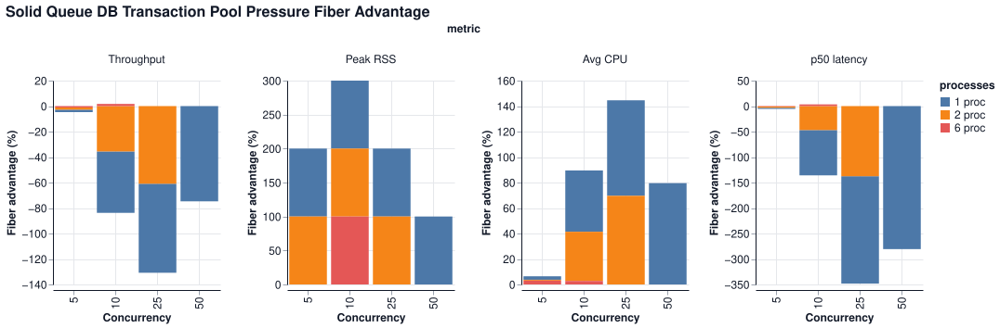
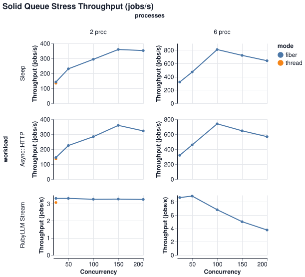
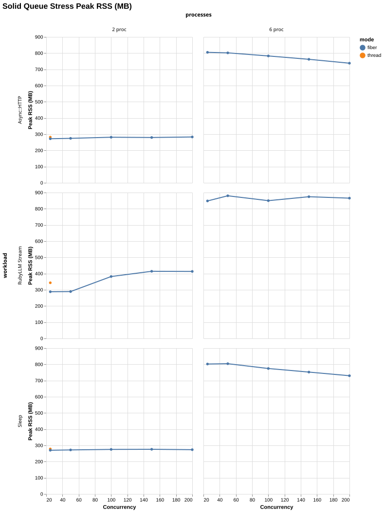

<!-- Generated by bin/report from results/*.json. Edit lib/bench/report.rb or lib/bench/readme_prompt.md, not this file. -->

# Solid Queue Bench

This repository benchmarks Solid Queue `thread` execution against Solid Queue `fiber` execution across Rails-shaped background job workloads.

The latest checked-in results are from **April 24-25, 2026**, using Solid Queue revision `305bf4018352e099019f9f24502a18ee4794e64e`.

Generated artifacts are available in [results/README.md](results/README.md), with an interactive report at [results/index.html](results/index.html). Detailed suite reports are in:

- [Solid Queue results](results/solid-queue/README.md)
- [Async::Job results](results/async-job/README.md)
- [Solid Queue stress results](results/solid-queue-stress/README.md)

## Research Questions

- Is Solid Queue `fiber` faster than Solid Queue `thread` for the same workload?
- Does `fiber` reduce memory, CPU, latency, or database connection pressure?
- Do short DB bursts still work well with a smaller shared fiber pool?
- What happens when jobs pin database connections for a whole transaction?
- How much faster is Async::Job + Redis when the backend changes too?

## Headline Results

The headline Solid Queue matrix caps total concurrency at `60` so high process counts do not turn the main comparison into a pool-exhaustion test.


In this checked-in matrix:

- Solid Queue `fiber` produced the best observed throughput for every Solid Queue workload.
- The largest Solid Queue `fiber` throughput advantages were on `ruby_llm_stream` at **28.0%**, `http` at **22.5%**, `async_http` at **21.2%**, and `sleep` at **20.4%**.
- `cpu` was close, with a best observed `fiber` throughput advantage of **5.0%**.
- `db_transaction_pool_pressure` was also close on throughput, with a best observed `fiber` advantage of **1.7%** under default pool sizing.
- Async::Job changes the queue backend, so those numbers are a throughput-ceiling reference, not the same comparison as Solid Queue `fiber` vs Solid Queue `thread`.

### Solid Queue headline summary

| Workload | Best throughput | Throughput win rate | Lowest RSS observed | Lowest latency observed | Best `fiber` throughput delta |
| --- | ---: | ---: | ---: | ---: | ---: |
| Sleep | `fiber`, 511.58 jobs/s | 6/9 | `thread`, 133.9 MB | `fiber`, p50 1177.70 ms, p95 1875.81 ms | +20.4% |
| Async::HTTP | `fiber`, 498.99 jobs/s | 6/9 | `fiber`, 135.1 MB | `fiber`, p50 1210.55 ms, p95 1912.63 ms | +21.2% |
| RubyLLM Stream | `fiber`, 7.04 jobs/s | 9/9 | `fiber`, 141.8 MB | `fiber`, p50 2789.42 ms, p95 2835.35 ms | +28.0% |
| CPU | `fiber`, 109.80 jobs/s | 6/9 | `fiber`, 134.3 MB | `fiber`, p50 2303.85 ms, p95 4273.39 ms | +5.0% |
| DB Queries | `fiber`, 393.07 jobs/s | 9/9 | `fiber`, 134.7 MB | `fiber`, p50 748.48 ms, p95 1226.66 ms | +13.9% |
| DB Mixed | `fiber`, 334.75 jobs/s | 5/9 | `fiber`, 135.3 MB | `fiber`, p50 899.22 ms, p95 1457.10 ms | +13.1% |
| DB Transaction | `fiber`, 195.27 jobs/s | 4/9 | `fiber`, 133.3 MB | `fiber`, p50 1533.01 ms, p95 2443.64 ms | +19.7% |
| DB Transaction Pool Pressure | `fiber`, 194.45 jobs/s | 1/9 | `fiber`, 135.4 MB | `fiber`, p50 1526.38 ms, p95 2425.32 ms | +1.7% |
| Net::HTTP | `fiber`, 476.07 jobs/s | 6/9 | `fiber`, 133.6 MB | `fiber`, p50 1244.33 ms, p95 2041.68 ms | +22.5% |

## DB Workloads

The DB workloads are split intentionally:

- `db_queries` and `db_mixed` model short database bursts. These answer whether fiber execution still works well when jobs briefly use Active Record connections.
- `db_transaction` runs the reads and writes inside one transaction with matched pools. These results answer the fair executor/runtime comparison.
- `db_transaction_pool_pressure` runs the same transaction under default pools. These results answer database pool sizing pressure, not the same fairness question as the matched-pool transaction run.




DB-specific results from the checked-in Solid Queue matrix:

| Workload | Pool framing | Best throughput | Throughput win rate | Best `fiber` throughput delta | Interpretation |
| --- | --- | ---: | ---: | ---: | --- |
| DB Queries | Short DB bursts | 393.07 jobs/s | 9/9 | +13.9% | `fiber` won every matched cell in this workload. |
| DB Mixed | DB reads, delayed HTTP, DB writes | 334.75 jobs/s | 5/9 | +13.1% | `fiber` helped most where the workload mixed DB work with waiting. |
| DB Transaction | Matched pools | 195.27 jobs/s | 4/9 | +19.7% | Fair transaction executor/runtime comparison. |
| DB Transaction Pool Pressure | Default pools | 194.45 jobs/s | 1/9 | +1.7% | Pool-sizing pressure test; throughput was close. |

## Stress Suite

The stress suite removes the headline matrix’s total concurrency cap. Its purpose is to show where high-concurrency workers stop completing planned cells, especially when database connection pool limits become the ceiling.

In the checked-in stress suite, each workload planned `10` thread cells and `10` fiber cells:

| Workload | Thread cells completed | Fiber cells completed |
| --- | ---: | ---: |
| Sleep | 1/10 | 10/10 |
| Async::HTTP | 1/10 | 10/10 |
| RubyLLM Stream | 1/10 | 10/10 |

Stress charts:






Stress suite best observed throughput:

| Workload | Best throughput | Best `fiber` throughput delta | Tests completed |
| --- | ---: | ---: | ---: |
| Sleep | `fiber`, 807.53 jobs/s | +6.2% | 11/20 |
| Async::HTTP | `fiber`, 739.49 jobs/s | +6.4% | 11/20 |
| RubyLLM Stream | `fiber`, 8.86 jobs/s | +7.8% | 11/20 |

Full stress details: [results/solid-queue-stress/README.md](results/solid-queue-stress/README.md).

## Async::Job Comparison

Async::Job is included as a reference point for a different backend: Async::Job + Redis.

That means this is **not** the same comparison as Solid Queue `fiber` vs Solid Queue `thread`. It changes the queue backend, so treat these numbers as a throughput-ceiling reference for the same benchmark shapes.

| Workload | Solid Queue `fiber` best | Async::Job best | Async::Job delta |
| --- | ---: | ---: | ---: |
| Sleep | 511.58 jobs/s | 635.94 jobs/s | +24.3% |
| Async::HTTP | 498.99 jobs/s | 653.93 jobs/s | +31.1% |
| RubyLLM Stream | 7.04 jobs/s | 16.87 jobs/s | +139.6% |
| CPU | 109.80 jobs/s | 120.18 jobs/s | +9.5% |

Full Async::Job details: [results/async-job/README.md](results/async-job/README.md).

## Methodology

- Timing starts after workers are ready.
- `jobs_per_second` counts successful jobs only.
- Latency percentiles are from successful jobs only.
- Each matrix cell is repeated and reports a real representative run, not a synthetic average row.
- The headline matrix caps total concurrency at `60` so high process counts do not turn the main comparison into a pool-exhaustion test.
- The stress matrix removes that cap to show where high-concurrency thread workers stop completing planned cells.
- Streaming workloads are child-job aware: a run is not complete until downstream broadcast jobs finish.

Benchmark matrices:

| Suite | Workloads | Concurrencies | Processes | Modes | Repeat | Max total concurrency |
| --- | --- | --- | --- | --- | ---: | ---: |
| Solid Queue | `sleep`, `async_http`, `ruby_llm_stream`, `cpu`, `db_queries`, `db_mixed`, `db_transaction`, `db_transaction_pool_pressure`, `http` | 5, 10, 25, 50, 100 | 1, 2, 6 | `thread`, `fiber` | 3 | 60 |
| Async::Job | `sleep`, `async_http`, `ruby_llm_stream`, `cpu` | 5, 10, 25, 50, 100 | 1, 2, 6 | `fiber` | 3 | 60 |
| Solid Queue Stress | `sleep`, `async_http`, `ruby_llm_stream` | 25, 50, 100, 150, 200 | 2, 6 | `thread`, `fiber` | 3 | none |

`bin/report` generates the public README and narrative from checked-in JSON and CSV artifacts. When `OPENAI_API_KEY` is set, it uses RubyLLM for the public README and narrative.

## Workloads

| Name | Shape | Purpose |
| --- | --- | --- |
| `sleep` | `Kernel.sleep` | Cooperative wait upper bound |
| `async_http` | Local `Async::HTTP` call | Fiber-friendly I/O |
| `ruby_llm_stream` | Fake OpenAI SSE + RubyLLM chat + Turbo broadcasts | Production-shaped streaming |
| `cpu` | SHA256 loop | CPU-bound control |
| `http` | Local `Net::HTTP` call | Blocking HTTP control |
| `db_queries` | Sequential DB reads plus writes | Report generation / data sync without external I/O |
| `db_mixed` | DB reads, delayed HTTP call, then DB writes | Read state, call API, write result |
| `db_transaction` | DB reads and writes in one transaction | Fair transaction executor comparison with matched pools |
| `db_transaction_pool_pressure` | Same transaction under default pools | Supplementary pool-sizing pressure test |

## Setup

Requirements:

- Ruby 4.0+
- PostgreSQL
- Redis, either local on 127.0.0.1:6379 or auto-started through Docker for Async::Job

The benchmark expects Solid Queue from a local path:

```ruby
gem "solid_queue", path: "../solid_queue"
```

Setup commands:

```sh
export DB_USER=your_user
export DB_PASSWORD=your_password
source .env
bin/setup
```

Notes:

- `bin/setup` installs gems, prepares the database, ensures the Solid Queue schema exists, and loads the RubyLLM model catalog.
- `.env` is a shell-friendly `OPENAI_API_KEY` export; source it or set `OPENAI_API_KEY` another way.

## Running

Sweep tasks:

```sh
bundle exec rake sweep:solid_queue_headline   # Headline Solid Queue
bundle exec rake sweep:solid_queue_stress      # Stress suite
bundle exec rake sweep:async_job_headline      # Headline Async::Job
bundle exec rake sweep:families                # Both headline families
bundle exec rake sweep:full                    # Headline + HTTP control + DB
bundle exec rake sweep:publish                 # Full publishable suite
```

## Caveats

- The data shows best and lowest observed results from this tested matrix; it does not prove fiber wins at every concurrency, process count, or pool size.
- Async::Job changes the backend, so those numbers are a backend comparison rather than a Solid Queue mode comparison.
- Matched-pool DB transaction results answer runtime fairness; default-pool transaction pressure results answer sizing pressure.
- The harness uses aggressive queue polling, so these numbers reflect execution behavior under a low-latency benchmark configuration, not default production settings.
