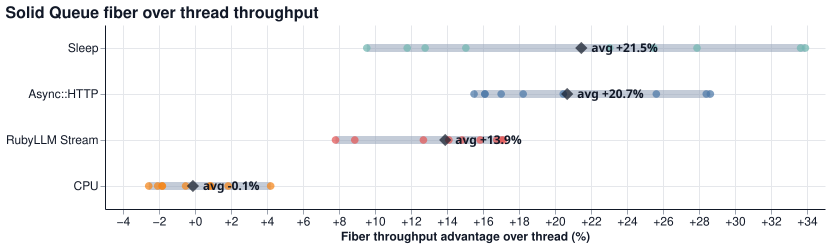
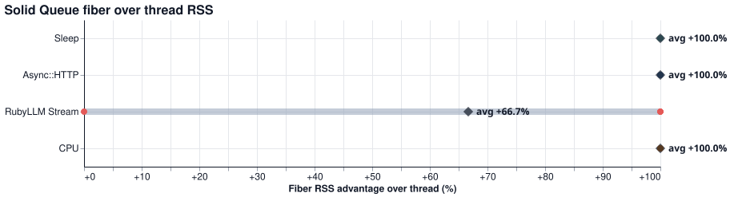
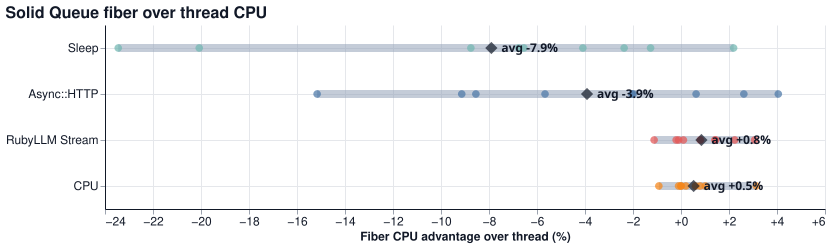
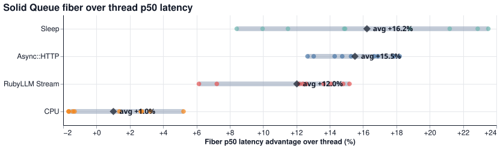
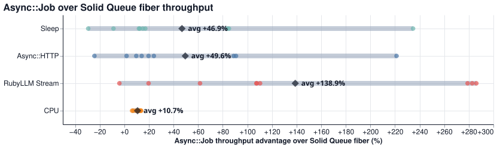
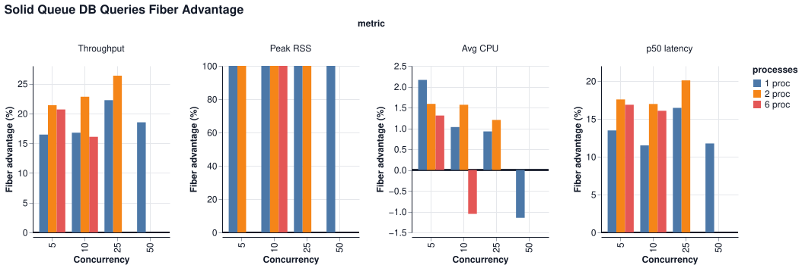
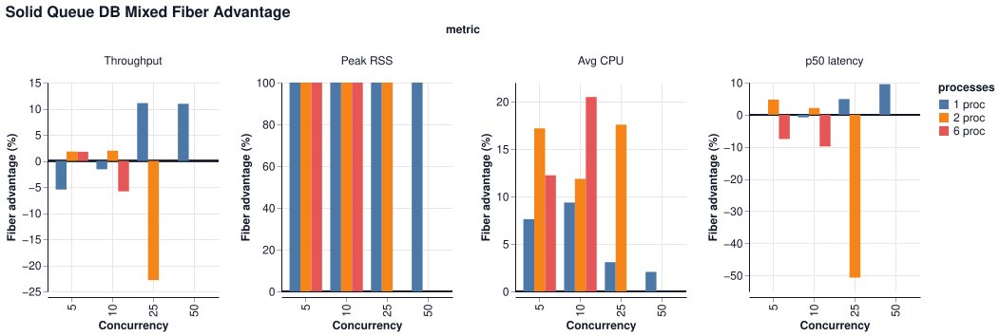
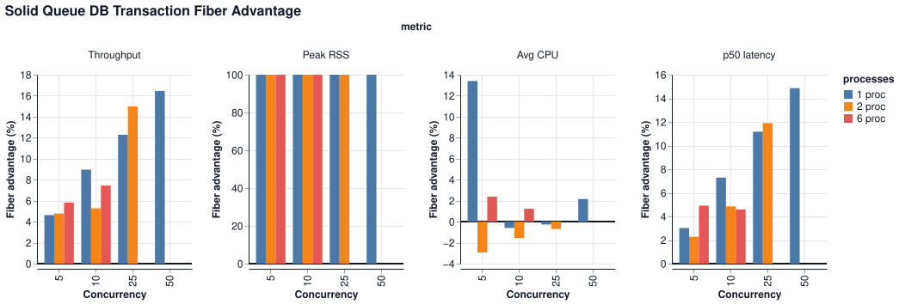
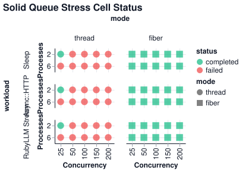

<!-- Generated by bin/report from results/*.json. Edit lib/bench/report.rb or lib/bench/readme_prompt.md, not this file. -->

# Solid Queue Bench

This repo benchmarks Solid Queue `fiber` and `thread` execution modes across Rails job shapes that wait, stream, talk to the database, and burn CPU.

Here, `concurrency = N` is per worker process: Solid Queue runs `threads: N` in thread mode or `fibers: N` in fiber mode, and `processes` is the number of worker OS processes. For example, `concurrency = 10` and `processes = 6` means `60` total execution slots.

Latest checked-in results: **October 6, 2026**.
Checked-in datasets were produced with Ruby `4.0.2` and Active Support isolated execution `fiber`.
Dependencies: rails `8.1.4`, solid_queue `1.7.0`, ruby_llm `2.0.0`, async-job-adapter-active_job `0.21.0`, async-job-processor-redis `0.3.1`.

RubyLLM 2.0 versus upcoming 2.1, including recommended connection reuse: [comparison](results/ruby-llm/README.md).

Full generated artifacts: [results](results/README.md), [Solid Queue](results/solid-queue/README.md), [Async::Job](results/async-job/README.md), and [stress](results/solid-queue-stress/README.md).

## Research Questions

- Is Solid Queue `fiber` faster than Solid Queue `thread` for the same workload?
- With matched DB pools, does `fiber` reduce memory, CPU, or latency?
- In the separate pool-policy suite, do short DB bursts still work well with a smaller shared fiber pool?
- What happens when jobs pin database connections for a whole transaction?
- How much faster is Async::Job + Redis when the backend changes too?

## Methodology

The public README covers four views of the same benchmark app: a capped Solid Queue headline suite, capped DB-focused supplementary runs, an uncapped Solid Queue stress suite, and an Async::Job + Redis reference run on the headline workloads. A separate Solid Queue pool-policy suite can be generated for mode-specific DB pool sizing, but it is not part of the primary executor comparison.

- Timing starts after workers are ready.
- `jobs_per_second` counts successful jobs only.
- Latency percentiles are from successful jobs only.
- Each matrix cell is repeated.
- In Solid Queue, `concurrency = N` means `threads: N` in thread mode or `fibers: N` in fiber mode. `Processes` is the number of worker OS processes.
- The headline suite is limited to `sleep`, `async_http`, `ruby_llm_stream`, and `cpu`.
- Supplementary Solid Queue runs add `http`, `db_queries`, `db_mixed`, and `db_transaction`.
- Primary Solid Queue headline and supplementary sweep tasks are configured for matched DB pools for `thread` and `fiber`.
- The optional pool-policy sweep keeps the mode-specific DB pools and answers a separate operational question.
- The headline and supplementary suites cap total concurrency at `60` so high process counts do not turn the main comparison into a pool-exhaustion test.
- Cells above that cap are intentionally omitted from the capped suites, so higher concurrencies may show only `1 proc` results.
- The stress suite removes that cap and is best read as a current Solid Queue failure-envelope test, not as a fundamental thread-vs-fiber law.
- Streaming workloads are child-job aware: a run is not complete until downstream broadcast jobs finish.

Checked-in datasets report the median real run by `jobs_per_second`; ties break on execution throughput, successful jobs, then failed jobs.

Benchmark matrices:

| Suite | Workloads | Concurrencies | Processes | Modes | Repeat | Max total concurrency |
|---|---|---|---|---|---:|---|
| Solid Queue headline | `sleep`, `async_http`, `ruby_llm_stream`, `cpu` | `5`, `10`, `25`, `50`, `100` | `1`, `2`, `6` | `thread`, `fiber` | 3 | 60 |
| Solid Queue supplementary | `http`, `db_queries`, `db_mixed`, `db_transaction` | `5`, `10`, `25`, `50`, `100` | `1`, `2`, `6` | `thread`, `fiber` | 3 | 60 |
| Async::Job headline | `sleep`, `async_http`, `ruby_llm_stream`, `cpu` | `5`, `10`, `25`, `50`, `100` | `1`, `2`, `6` | `fiber` | 3 | 60 |
| Solid Queue stress | `sleep`, `async_http`, `ruby_llm_stream` | `25`, `50`, `100`, `150`, `200` | `2`, `6` | `thread`, `fiber` | 3 | none |

Database pool policy used by the benchmark:

- `config/database.yml` uses `ENV.fetch("DB_POOL", ENV.fetch("RAILS_MAX_THREADS", 5))`.
- Benchmark workers set `DB_POOL` explicitly, so the published results use benchmark pool policy rather than passive Rails defaults.
- Primary Solid Queue rows use matched pools: `DB_POOL = concurrency + 5` per worker process for both `thread` and `fiber`.
- The optional Solid Queue pool-policy suite keeps the mode-specific policy: `thread` uses `DB_POOL = concurrency + 5`; `fiber` uses `DB_POOL = max(5, processes + 4)`.
- The stress suite uses the mode-specific pool policy unless `DB_POOL` is overridden for the run.
- Async::Job keeps its own benchmark-specific pool policy unless `ASYNC_JOB_DB_POOL` is set.
- `db_transaction_pool_pressure` is kept only as a backwards-compatible exploratory workload; the separate pool-policy suite is the preferred way to study mismatched DB pools.

## Headline Results

### Method

This section is the direct same-backend comparison: same Rails app, same jobs, same Solid Queue backend, same capped matrix, only the worker execution mode changes. It uses workloads `sleep`, `async_http`, `ruby_llm_stream`, `cpu`; concurrencies `5`, `10`, `25`, `50`, `100`; processes `1`, `2`, `6`; modes `thread`, `fiber`; 3 representative runs per cell; cells above total concurrency `60` are omitted.

For the Solid Queue comparison charts below, positive percentages always mean movement in fiber's favor: higher throughput or lower RSS, CPU, or p50 latency.











| Workload | Tests | Best Throughput | Lowest RSS | Lowest CPU | Lowest p50 Latency | Avg Fiber Throughput Delta | Best Fiber Throughput Delta |
|---|---:|---|---|---|---|---:|---:|
| Sleep | 18/18 | fiber, c=10, proc=6, 682.90 jobs/s | fiber, c=50, proc=1, 123.21 MB | thread, c=5, proc=1, 33.60% | fiber, c=10, proc=6, 909.95 ms | +21.5% across 9 cells | +33.9% at c=10, proc=2 |
| Async::HTTP | 18/18 | fiber, c=10, proc=6, 665.42 jobs/s | fiber, c=25, proc=1, 123.89 MB | thread, c=5, proc=1, 35.30% | fiber, c=10, proc=6, 900.20 ms | +20.7% across 9 cells | +28.6% at c=10, proc=2 |
| RubyLLM Stream | 18/18 | fiber, c=5, proc=6, 8.98 jobs/s | fiber, c=5, proc=1, 174.43 MB | thread, c=25, proc=1, 98.20% | fiber, c=5, proc=6, 2182.53 ms | +13.9% across 9 cells | +17.1% at c=25, proc=1 |
| CPU | 18/18 | fiber, c=5, proc=6, 154.84 jobs/s | fiber, c=50, proc=1, 124.69 MB | fiber, c=5, proc=1, 98.60% | fiber, c=5, proc=6, 1690.92 ms | -0.1% across 9 cells | +4.2% at c=50, proc=1 |

### Interpretation

Average fiber throughput deltas across the headline workloads were Sleep +21.5% across 9 cells, Async::HTTP +20.7% across 9 cells, RubyLLM Stream +13.9% across 9 cells, CPU -0.1% across 9 cells. The table shows the best observed point and the lowest resource rows; the paired-cell averages are the steadier signal than any single best cell.

Full supplementary Solid Queue results, including `http`, `db_queries`, `db_mixed`, and `db_transaction`, are in [results/solid-queue/README.md](results/solid-queue/README.md).

## DB Workloads

### Method

This section uses the same capped Solid Queue matrix as the headline suite, but focuses on `db_queries`, `db_mixed`, `db_transaction`. The primary Solid Queue rows set `DB_POOL` explicitly to the matched executor-comparison policy: `DB_POOL = concurrency + 5` per worker process for both `thread` and `fiber`.

| Workload | Shape | Best Throughput | Lowest RSS | Lowest CPU | Lowest p50 Latency | Avg Fiber Throughput Delta | Best Fiber Throughput Delta |
|---|---|---|---|---|---|---:|---:|
| DB Queries | 10 reads, 2 writes, no external delay | fiber, c=5, proc=6, 574.77 jobs/s | fiber, c=50, proc=1, 123.35 MB | fiber, c=5, proc=1, 95.00% | fiber, c=5, proc=6, 515.88 ms | +20.1% across 9 cells | +26.4% at c=25, proc=2 |
| DB Mixed | 10 reads, 50 ms delayed HTTP call, 2 writes | thread, c=10, proc=6, 393.76 jobs/s | fiber, c=50, proc=1, 124.73 MB | fiber, c=5, proc=1, 43.70% | thread, c=10, proc=6, 731.30 ms | -0.9% across 9 cells | +11.1% at c=25, proc=1 |
| DB Transaction | 10 reads and 2 writes in one transaction, 20 ms delay per read (200 ms total delay) | fiber, c=10, proc=6, 220.94 jobs/s | fiber, c=50, proc=1, 124.67 MB | fiber, c=5, proc=1, 16.80% | fiber, c=10, proc=6, 1342.89 ms | +9.0% across 9 cells | +16.5% at c=50, proc=1 |

`DB Transaction` uses the same matched pool (`concurrency + 5` per process for both modes), so it stays an executor comparison rather than a pool-policy comparison.







### Interpretation

Average fiber throughput deltas across the DB workloads were DB Queries +20.1% across 9 cells, DB Mixed -0.9% across 9 cells, DB Transaction +9.0% across 9 cells. `db_transaction` is separated from the short DB-burst workloads because each job pins a connection for the lifetime of the transaction; the matched pool keeps that result focused on executor behavior.

## Stress Suite

### Method

This section removes the headline cap and pushes higher connection demand. It uses workloads `sleep`, `async_http`, `ruby_llm_stream`; concurrencies `25`, `50`, `100`, `150`, `200`; processes `2`, `6`; modes `thread`, `fiber`; 3 representative runs per cell; there is no total concurrency cap. Each point in the status chart is a planned `(mode, concurrency, processes)` cell; completed cells are green and missing/failed cells are red. This section is primarily about completion under pressure, not about peak throughput.



| Workload | Fiber Cells | Thread Cells |
|---|---:|---:|
| Sleep | 10/10 | 1/10 |
| Async::HTTP | 10/10 | 1/10 |
| RubyLLM Stream | 10/10 | 1/10 |

### Interpretation

Completed stress cells were Sleep: thread 1/10, fiber 10/10; Async::HTTP: thread 1/10, fiber 10/10; RubyLLM Stream: thread 1/10, fiber 10/10. Read throughput alongside these completion counts; this suite measures the current failure envelope under high connection demand.

## Async::Job Comparison

### Method

This section reuses the headline workload matrix, but changes the backend to Async::Job + Redis and runs only `fiber` mode. It uses workloads `sleep`, `async_http`, `ruby_llm_stream`, `cpu`; concurrencies `5`, `10`, `25`, `50`, `100`; processes `1`, `2`, `6`; modes `fiber`; 3 representative runs per cell; cells above total concurrency `60` are omitted. Read it as a backend ceiling reference, not as the same comparison as Solid Queue `thread` versus `fiber`.

| Workload | Solid Queue Fiber Best | Async::Job Best | Async::Job Delta |
|---|---:|---:|---:|
| Sleep | 682.90 jobs/s | 721.05 jobs/s | +5.6% |
| Async::HTTP | 665.42 jobs/s | 701.48 jobs/s | +5.4% |
| RubyLLM Stream | 8.98 jobs/s | 12.46 jobs/s | +38.8% |
| CPU | 154.84 jobs/s | 164.64 jobs/s | +6.3% |

### Interpretation

The table compares the best observed throughput for each backend. Because Async::Job uses Redis and a different runtime stack, these differences do not isolate the effect of Solid Queue’s executor mode.

## Workloads

| Workload | Shape | Purpose |
|---|---|---|
| `sleep` | `Kernel.sleep` | Cooperative wait upper bound |
| `async_http` | Local `Async::HTTP` call | Fiber-friendly I/O |
| `ruby_llm_stream` | Fake OpenAI SSE + RubyLLM chat + Turbo broadcasts | Production-shaped streaming |
| `cpu` | SHA256 loop | CPU-bound control |
| `http` | Local `Net::HTTP` call | Blocking HTTP control |
| `db_queries` | Sequential DB reads plus writes | Report generation / data sync without external I/O |
| `db_mixed` | DB reads, delayed HTTP call, then DB writes | Read state, call API, write result |
| `db_transaction` | DB reads and writes in one transaction | Fair transaction executor comparison with matched pools |

## Setup

Requirements: Ruby 4.0.2, PostgreSQL, Redis, either local on 127.0.0.1:6379 or auto-started through Docker for Async::Job.

The Gemfile currently pins Solid Queue as:

```ruby
gem "solid_queue", "~> 1.7"
```

```bash
export DB_USER=your_user
export DB_PASSWORD=your_password
bin/setup
```

`bin/setup` installs gems, prepares the database, ensures the Solid Queue schema exists, and loads the RubyLLM model catalog.
Benchmarks use a local fake provider and require no API key. Set `OPENAI_API_KEY` only for the optional AI-written report or real chat UI.

Existing 1.x benchmark databases: run `bin/setup --skip-server` with the stable bundle first. It runs the archived 2.0 upgrade before the 2.1 schema additions. New databases load the checked-in schema.

The released bundle is `Gemfile`; `BUNDLE_GEMFILE=Gemfile.main bundle install` installs the pinned main revision. `bin/compare_rubyllm` runs both and regenerates the separate comparison, with connection reuse enabled in its main-reuse configuration. No API key is needed for benchmarks.

## Running

```bash
bundle exec rake sweep:solid_queue_headline   # Headline Solid Queue
bundle exec rake sweep:solid_queue_stress      # Stress suite
bundle exec rake sweep:solid_queue_pool_policy # Mode-specific DB pool suite
bundle exec rake sweep:async_job_headline      # Headline Async::Job
bundle exec rake sweep:families                # Both headline families
bundle exec rake sweep:full                    # Headline + HTTP control + DB
bundle exec rake sweep:publish                 # Public README/report suite
bundle exec rake sweep:publish_with_pool_policy # Public suite + pool policy
```

Single-workload sweeps are available too, including `sweep:sleep`, `sweep:db_queries`, `sweep:db_transaction`, `sweep:db_mixed`, `sweep:ruby_llm_stream`, and the `sweep:async_job_*` tasks.

Regenerate the public README, result summaries, charts, and narrative from existing artifacts:

```bash
bin/report
```

When `OPENAI_API_KEY` is set, `bin/report` asks RubyLLM to write the public README and narrative from the benchmark facts. Without it, the same command uses the deterministic fallback so tables and charts still update.

## Caveats

- The data shows best and lowest observed results from this tested matrix; it does not prove fiber wins at every concurrency, process count, or pool size.
- Async::Job changes the backend, so those numbers are a backend comparison rather than a Solid Queue mode comparison.
- Primary Solid Queue comparisons should be read from matched-pool datasets; the pool-policy suite answers the separate question about smaller fiber DB pools.
- Stress results reflect the current Solid Queue implementation under high connection demand and should not be read as a permanent thread-vs-fiber law.
- The harness uses aggressive queue polling, so these numbers reflect execution behavior under a low-latency benchmark configuration, not default production settings.
