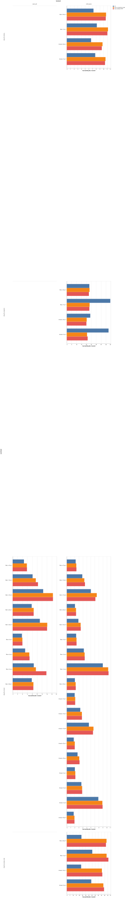

# RubyLLM 2.0 vs upcoming 2.1

Generated from the JSON and CSV artifacts beside this report. Each cell reports the median real run of three repetitions; JSON includes every repetition.

Main's primary configuration enables the [connection reuse recommended for 2.1](https://rubyllm.com/next/configuration-connection/#connection-reuse): `net_http_persistent` in thread workers and `async_http` inside the fiber workers' Async reactor. The default-adapter main run separates this opt-in from the other version changes.

All calls use a loopback fake OpenAI Chat Completions endpoint with HTTP/1.1 keep-alive. No external model calls, API charges, or TLS handshakes are involved. The connection counts measure accepted TCP connections serving LLM requests, not a simulated network-latency benefit.

The full gem dependency manifests are embedded in each JSON. Both bundles use the same Rails and Solid Queue releases; main permits JSON 3 while 2.0 requires JSON 2, so this is a comparison of the latest compatible stacks.

Both versions use the same PostgreSQL schema, including the additive 2.1 migrations, and the same model catalog. Migrations and history seeding run outside the timed jobs.

| Configuration | RubyLLM revision | Rails | Solid Queue | JSON |
|---|---|---|---|---|
| 2.0 | `2.0.0` | 8.1.4 | 1.7.0 | 2.21.2 |
| main, default HTTP | `94b9ab3e5eb242dd1de632b6ac4c2afcedda56ce` | 8.1.4 | 1.7.0 | 3.0.2 |
| main, connection reuse | `94b9ab3e5eb242dd1de632b6ac4c2afcedda56ce` | 8.1.4 | 1.7.0 | 3.0.2 |

The focused workloads follow [What’s New in 2.1](https://rubyllm.com/next/whats-new-in-2-1/).

Workloads:

- `ruby_llm_stream`: the existing persisted chat plus 40 streamed chunks, 20 ms apart, and downstream Turbo broadcast jobs. Same capped matrix as the headline suite.
- `ruby_llm_stream_only`: 500 chunks without a provider delay, chat/message persistence, or broadcasts; validates chunk count and usage. Main additionally persists standalone usage-ledger rows. Measures streaming work within a queue job.
- `ruby_llm_history`: rebuild a persisted 100-message chat ten times per job, with a fresh record each time. History and usage rows are seeded through real local calls before timing; Rails' default automatic scope inversing stays on.
- `ruby_llm_requests`: 20 calls per job, each using a new chat. This exercises connection sharing across chats and jobs; each response is checked. Main also writes one usage-ledger row per request, whereas 2.0 does not.

The repeated-call slowdown includes new usage persistence on this pinned main revision and development-mode SQL backtraces. [Controlled profiling](diagnostics/README.md) separates these costs: main is faster with equivalent persistence work. The original default-configuration measurements remain below.

The focused cases use 50 jobs, concurrency 5 and 25, one worker process, and matched DB pools. Throughput is jobs per second. Timing starts after workers report ready; queue overhead and first-use initialization inside jobs remain included. These are application job measurements, not reproductions of RubyLLM's microbenchmark timings.

Run `bin/compare_rubyllm` to run the comparison. It reuses a complete published 2.0 streaming baseline when its dependencies and matrix match; `--fresh` reruns that baseline too. `--resume` keeps already completed comparison datasets. Use `ruby -Ilib -rbench/llm_report -e 'Bench::LlmReport.call'` to regenerate this report.

## Paired throughput changes

Each cell gets equal weight in these averages; the detailed tables and individual repetitions show variation across the tested matrix.

| Backend | Workload | Mode | Cells | main default vs 2.0 | main reuse vs 2.0 |
|---|---|---|---:|---:|---:|
| async_job | ruby_llm_stream | fiber | 9 | +25.6% | +18.7% |
| solid_queue | ruby_llm_history | thread | 2 | +39.2% | +41.6% |
| solid_queue | ruby_llm_history | fiber | 2 | +40.5% | +42.0% |
| solid_queue | ruby_llm_requests | thread | 2 | -33.3% | -33.4% |
| solid_queue | ruby_llm_requests | fiber | 2 | -25.1% | -23.3% |
| solid_queue | ruby_llm_stream | thread | 9 | +11.8% | +11.5% |
| solid_queue | ruby_llm_stream | fiber | 9 | +12.7% | +12.3% |
| solid_queue | ruby_llm_stream_only | thread | 2 | +99.6% | +96.8% |
| solid_queue | ruby_llm_stream_only | fiber | 2 | +115.0% | +113.4% |

## Main with reuse: resources and latency

Changes are relative to 2.0 in matching cells; negative values mean lower measurements. CPU is average worker utilization, not CPU time per job.

| Backend | Workload | Mode | Peak RSS change | Average CPU change | p50 latency change |
|---|---|---|---:|---:|---:|
| async_job | ruby_llm_stream | fiber | -16.0% | -0.3% | -14.6% |
| solid_queue | ruby_llm_history | thread | -17.6% | -0.3% | -31.2% |
| solid_queue | ruby_llm_history | fiber | -13.7% | -0.9% | -31.1% |
| solid_queue | ruby_llm_requests | thread | -26.5% | -0.4% | +48.7% |
| solid_queue | ruby_llm_requests | fiber | -22.4% | +1.8% | +39.5% |
| solid_queue | ruby_llm_stream | thread | -24.8% | +2.3% | -10.1% |
| solid_queue | ruby_llm_stream | fiber | -28.7% | +2.3% | -10.8% |
| solid_queue | ruby_llm_stream_only | thread | -31.7% | -4.3% | -51.8% |
| solid_queue | ruby_llm_stream_only | fiber | -21.4% | -2.6% | -54.2% |

## async_job / ruby_llm_stream

| Mode | Concurrency | Processes | 2.0 jobs/s | main default jobs/s | main reuse jobs/s | Reuse vs 2.0 | Reuse peak RSS (MB) | Reuse connections / calls |
|---|---:|---:|---:|---:|---:|---:|---:|---|
| fiber | 5 | 1 | 3.78 | 3.98 | 3.97 | +5.0% | 180.3 | 5 / 20 |
| fiber | 10 | 1 | 4.61 | 5.83 | 5.79 | +25.6% | 175.1 | 10 / 20 |
| fiber | 25 | 1 | 7.77 | 8.58 | 8.59 | +10.6% | 176.2 | 20 / 20 |
| fiber | 50 | 1 | 7.80 | 8.44 | 8.47 | +8.6% | 169.9 | 20 / 20 |
| fiber | 5 | 2 | 5.10 | 6.89 | 6.80 | +33.3% | 330.2 | 10 / 20 |
| fiber | 10 | 2 | 8.14 | 10.34 | 9.45 | +16.1% | 320.0 | 19 / 20 |
| fiber | 25 | 2 | 11.10 | 14.05 | 14.12 | +27.2% | 309.9 | 20 / 20 |
| fiber | 5 | 6 | 8.62 | 13.76 | 9.49 | +10.1% | 870.8 | 19 / 20 |
| fiber | 10 | 6 | 12.46 | 16.45 | 16.43 | +31.9% | 852.5 | 20 / 20 |

Artifacts: [2.0 JSON](2.0/async-job-ruby-llm-stream-data.json) / [CSV](2.0/async-job-ruby-llm-stream-data.csv); [main, default HTTP JSON](main-default/async-job-ruby-llm-stream-data.json) / [CSV](main-default/async-job-ruby-llm-stream-data.csv); [main, connection reuse JSON](main-reuse/async-job-ruby-llm-stream-data.json) / [CSV](main-reuse/async-job-ruby-llm-stream-data.csv)

## solid_queue / ruby_llm_history

| Mode | Concurrency | Processes | 2.0 jobs/s | main default jobs/s | main reuse jobs/s | Reuse vs 2.0 | Reuse peak RSS (MB) | Reuse connections / calls |
|---|---:|---:|---:|---:|---:|---:|---:|---|
| thread | 5 | 1 | 7.74 | 10.41 | 10.54 | +36.2% | 134.2 | n/a |
| thread | 25 | 1 | 6.62 | 9.53 | 9.73 | +47.0% | 226.3 | n/a |
| fiber | 5 | 1 | 8.18 | 11.05 | 11.21 | +37.0% | 131.9 | n/a |
| fiber | 25 | 1 | 7.27 | 10.61 | 10.69 | +47.0% | 240.9 | n/a |

Artifacts: [2.0 JSON](2.0/solid-queue-ruby-llm-history-data.json) / [CSV](2.0/solid-queue-ruby-llm-history-data.csv); [main, default HTTP JSON](main-default/solid-queue-ruby-llm-history-data.json) / [CSV](main-default/solid-queue-ruby-llm-history-data.csv); [main, connection reuse JSON](main-reuse/solid-queue-ruby-llm-history-data.json) / [CSV](main-reuse/solid-queue-ruby-llm-history-data.csv)

## solid_queue / ruby_llm_requests

| Mode | Concurrency | Processes | 2.0 jobs/s | main default jobs/s | main reuse jobs/s | Reuse vs 2.0 | Reuse peak RSS (MB) | Reuse connections / calls |
|---|---:|---:|---:|---:|---:|---:|---:|---|
| thread | 5 | 1 | 42.62 | 21.31 | 20.68 | -51.5% | 149.4 | 5 / 1000 |
| thread | 25 | 1 | 23.98 | 20.01 | 20.32 | -15.3% | 154.2 | 8 / 1000 |
| fiber | 5 | 1 | 44.40 | 23.05 | 23.29 | -47.5% | 144.7 | 4 / 1000 |
| fiber | 25 | 1 | 23.03 | 22.56 | 23.23 | +0.9% | 162.5 | 7 / 1000 |

Artifacts: [2.0 JSON](2.0/solid-queue-ruby-llm-requests-data.json) / [CSV](2.0/solid-queue-ruby-llm-requests-data.csv); [main, default HTTP JSON](main-default/solid-queue-ruby-llm-requests-data.json) / [CSV](main-default/solid-queue-ruby-llm-requests-data.csv); [main, connection reuse JSON](main-reuse/solid-queue-ruby-llm-requests-data.json) / [CSV](main-reuse/solid-queue-ruby-llm-requests-data.csv)

Connection counts below sum the representative runs across the four cells. Every configuration performs the same number of requests.

| Configuration | Accepted connections | Requests |
|---|---:|---:|
| 2.0 | 4000 | 4000 |
| main, default HTTP | 4000 | 4000 |
| main, connection reuse | 24 | 4000 |

## solid_queue / ruby_llm_stream

| Mode | Concurrency | Processes | 2.0 jobs/s | main default jobs/s | main reuse jobs/s | Reuse vs 2.0 | Reuse peak RSS (MB) | Reuse connections / calls |
|---|---:|---:|---:|---:|---:|---:|---:|---|
| thread | 5 | 1 | 2.02 | 2.15 | 2.13 | +5.4% | 153.4 | 6 / 20 |
| thread | 10 | 1 | 1.97 | 2.10 | 2.11 | +7.1% | 171.9 | 11 / 20 |
| thread | 25 | 1 | 1.75 | 1.99 | 2.00 | +14.3% | 167.8 | 20 / 20 |
| thread | 50 | 1 | 1.73 | 1.92 | 1.91 | +10.4% | 210.1 | 20 / 20 |
| thread | 5 | 2 | 3.64 | 3.84 | 3.83 | +5.2% | 306.3 | 10 / 20 |
| thread | 10 | 2 | 3.37 | 3.78 | 3.77 | +11.9% | 287.4 | 20 / 20 |
| thread | 25 | 2 | 2.69 | 3.19 | 3.12 | +16.0% | 326.6 | 20 / 20 |
| thread | 5 | 6 | 7.87 | 8.93 | 8.88 | +12.8% | 865.1 | 20 / 20 |
| thread | 10 | 6 | 5.52 | 6.54 | 6.66 | +20.7% | 949.4 | 20 / 20 |
| fiber | 5 | 1 | 2.34 | 2.44 | 2.43 | +3.8% | 147.7 | 5 / 20 |
| fiber | 10 | 1 | 2.22 | 2.41 | 2.38 | +7.2% | 137.1 | 10 / 20 |
| fiber | 25 | 1 | 2.05 | 2.32 | 2.31 | +12.7% | 167.3 | 20 / 20 |
| fiber | 50 | 1 | 2.02 | 2.24 | 2.22 | +9.9% | 171.3 | 20 / 20 |
| fiber | 5 | 2 | 4.26 | 4.48 | 4.46 | +4.7% | 294.7 | 10 / 20 |
| fiber | 10 | 2 | 3.87 | 4.54 | 4.38 | +13.2% | 274.0 | 20 / 20 |
| fiber | 25 | 2 | 2.90 | 3.49 | 3.46 | +19.3% | 297.8 | 20 / 20 |
| fiber | 5 | 6 | 8.98 | 10.42 | 10.33 | +15.0% | 839.0 | 20 / 20 |
| fiber | 10 | 6 | 6.01 | 7.14 | 7.48 | +24.5% | 782.0 | 20 / 20 |

Artifacts: [2.0 JSON](2.0/solid-queue-ruby-llm-stream-data.json) / [CSV](2.0/solid-queue-ruby-llm-stream-data.csv); [main, default HTTP JSON](main-default/solid-queue-ruby-llm-stream-data.json) / [CSV](main-default/solid-queue-ruby-llm-stream-data.csv); [main, connection reuse JSON](main-reuse/solid-queue-ruby-llm-stream-data.json) / [CSV](main-reuse/solid-queue-ruby-llm-stream-data.csv)

## solid_queue / ruby_llm_stream_only

| Mode | Concurrency | Processes | 2.0 jobs/s | main default jobs/s | main reuse jobs/s | Reuse vs 2.0 | Reuse peak RSS (MB) | Reuse connections / calls |
|---|---:|---:|---:|---:|---:|---:|---:|---|
| thread | 5 | 1 | 38.87 | 59.12 | 58.07 | +49.4% | 139.7 | 5 / 50 |
| thread | 25 | 1 | 22.82 | 56.39 | 55.75 | +144.3% | 154.8 | 8 / 50 |
| fiber | 5 | 1 | 40.46 | 66.06 | 63.20 | +56.2% | 135.0 | 4 / 50 |
| fiber | 25 | 1 | 23.31 | 62.19 | 63.08 | +170.6% | 153.0 | 7 / 50 |

Artifacts: [2.0 JSON](2.0/solid-queue-ruby-llm-stream-only-data.json) / [CSV](2.0/solid-queue-ruby-llm-stream-only-data.csv); [main, default HTTP JSON](main-default/solid-queue-ruby-llm-stream-only-data.json) / [CSV](main-default/solid-queue-ruby-llm-stream-only-data.csv); [main, connection reuse JSON](main-reuse/solid-queue-ruby-llm-stream-only-data.json) / [CSV](main-reuse/solid-queue-ruby-llm-stream-only-data.csv)

